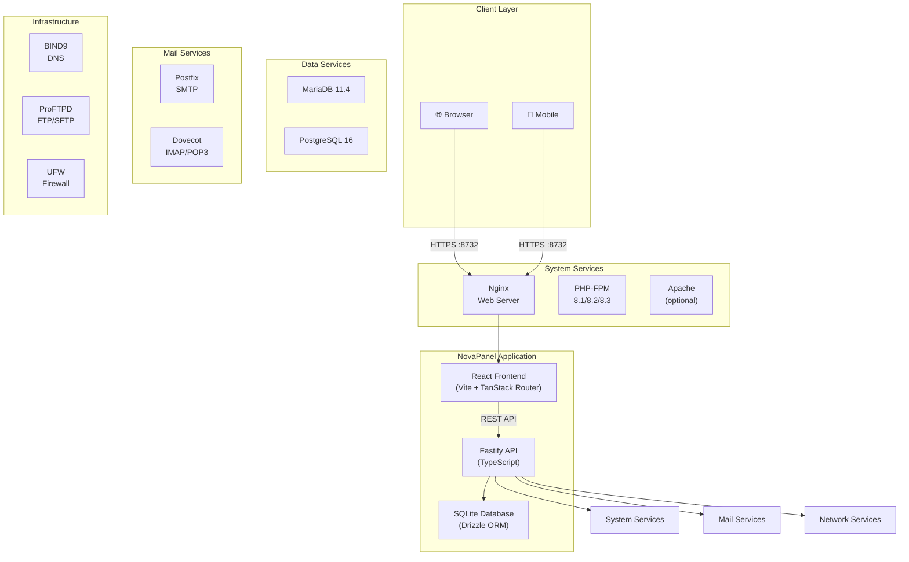

<!--
Meta Description: NovaPanel is a free, open-source server management panel for Linux. A self-hosted web hosting control panel alternative to cPanel and Plesk. Manage websites, databases, email, DNS, SSL, and more.
Keywords: server management panel, web hosting control panel, open source cPanel alternative, Linux server administration, self-hosted control panel, server monitoring dashboard, web server management, free hosting panel, VPS management tool, dedicated server control panel
-->

<div align="center">

# NovaPanel

**Modern Server Management Panel for Linux**

*A free, open-source web hosting control panel. The powerful self-hosted alternative to cPanel and Plesk.*

[](https://opensource.org/licenses/MIT)
[](https://github.com/marufnwu/NovaPanel/stargazers)
[](https://github.com/marufnwu/NovaPanel/issues)
[](https://github.com/marufnwu/NovaPanel/commits/master)


<!-- Screenshot: NovaPanel Dashboard -->
<!--  -->
*[📷 Dashboard Screenshot Placeholder — Production screenshots coming soon]*

</div>

---

## ✨ Features

NovaPanel is a comprehensive **Linux server administration** tool that provides all the essentials for managing a web hosting environment. Whether you're a system administrator managing multiple servers or a developer deploying applications, NovaPanel simplifies server management.

### 🌐 Web & Development

| Feature | Description |
|---------|-------------|
| 🌐 **Web Server** | Nginx (frontend) + Apache (backend for .htaccess support) |
| 🖥️ **PHP Support** | PHP 8.1/8.2/8.3 FPM with per-site version selection |
| 📁 **File Manager** | Full-featured web-based file manager with code editor |
| 💻 **Web Terminal** | Browser-based terminal access (xterm.js + node-pty) |
| 📋 **Cron Jobs** | Visual crontab management with expression builder |

### 🗄️ Databases

| Feature | Description |
|---------|-------------|
| 🐘 **MariaDB** | MariaDB 11.4 with full database management |
| 🐘 **PostgreSQL** | PostgreSQL 16 support for modern applications |
| 📥 **Import/Export** | Easy database backup and restore |

### 📧 Email Server

| Feature | Description |
|---------|-------------|
| 📨 **Mail Transfer** | Postfix SMTP server with virtual mailboxes |
| 📬 **IMAP/POP3** | Dovecot IMAP/POP3 server |
| 🔐 **DKIM & SPF** | Email authentication for better deliverability |
| 🛡️ **Spam Protection** | SpamAssassin integration |

### 🔒 Security

| Feature | Description |
|---------|-------------|
| 🔒 **SSL/TLS** | Let's Encrypt auto-renewal + custom certificates |
| 🔥 **Firewall** | UFW firewall management |
| 🛡️ **Fail2Ban** | Intrusion prevention system |
| 🔐 **2FA** | TOTP two-factor authentication |

### 🌐 DNS & Domains

| Feature | Description |
|---------|-------------|
| 🌍 **DNS Management** | BIND9 with visual zone file management |
| 🔗 **Cloudflare Tunnel** | Zero-config tunnel support |
| 🌐 **Domain Management** | Domains, subdomains, aliases, redirects |

### 📦 Storage & Backup

| Feature | Description |
|---------|-------------|
| 📦 **FTP/SFTP** | ProFTPD with virtual users |
| 🔄 **Automated Backups** | Scheduled backup with one-click restore |
| 💾 **Disk Monitoring** | Real-time disk usage tracking |

### 🚀 Deployment

| Feature | Description |
|---------|-------------|
| ⚡ **One-Click Apps** | WordPress, phpMyAdmin, and more |
| 📊 **Server Monitoring** | CPU, RAM, network stats with charts |
| 📜 **Audit Log** | Full action trail for accountability |
| 🔑 **API Tokens** | RESTful API for automation |

---

## 🚀 Quick Install

### One-Line Install (Bare Metal)

The fastest way to get NovaPanel running on a fresh Ubuntu or Debian server:

```bash
curl -fsSL https://raw.githubusercontent.com/marufnwu/NovaPanel/release/scripts/install.sh | sudo bash
```

With custom settings:

```bash
curl -fsSL https://raw.githubusercontent.com/marufnwu/NovaPanel/release/scripts/install.sh | \
  sudo ADMIN_EMAIL=admin@yourdomain.com \
         ADMIN_PASSWORD=YourStrongPassword123 \
         PANEL_URL=http://yourserver.com:8732 \
         bash
```

### Docker Install

```bash
git clone https://github.com/marufnwu/NovaPanel.git
cd NovaPanel
docker compose up -d
```

### Uninstall NovaPanel

To safely remove NovaPanel from your server (preserves user data and databases):

```bash
curl -fsSL https://raw.githubusercontent.com/marufnwu/NovaPanel/release/scripts/uninstall.sh | sudo bash -s -- --confirm
```

For full purge (removes all data including websites and databases):

```bash
curl -fsSL https://raw.githubusercontent.com/marufnwu/NovaPanel/release/scripts/uninstall.sh | sudo bash -s -- --confirm --purge
```

To also remove system packages (nginx, php, mariadb, etc.):

```bash
curl -fsSL https://raw.githubusercontent.com/marufnwu/NovaPanel/release/scripts/uninstall.sh | sudo bash -s -- --confirm --purge --remove-packages
```

> ⚠️ **Always back up your data before using `--purge`!** Website data in `/var/www/` and databases are preserved by default.

### Access the Panel

After installation, access NovaPanel at: **`http://your-server-ip:8732`**

> ⚠️ **Default port is 8732** (not 80/3000). Make sure port 8732 is open in your firewall.

---

## 📋 Requirements

| Requirement | Minimum | Recommended |
|-------------|---------|-------------|
| **Operating System** | Ubuntu 22.04 / Debian 11 | Ubuntu 24.04 LTS |
| **RAM** | 1 GB | 2 GB+ |
| **Disk Space** | 10 GB | 20 GB+ |
| **Architecture** | x86_64 / ARM64 | x86_64 |
| **Root Access** | Required | Root (sudo) |

---

## 🏗️ Architecture



### Project Structure

```
NovaPanel/
├── apps/
│   ├── api/                    # Fastify backend (TypeScript)
│   │   ├── src/
│   │   │   ├── modules/        # Feature modules
│   │   │   │   ├── auth/       # Authentication & 2FA
│   │   │   │   ├── websites/   # Website management
│   │   │   │   ├── databases/  # DB management
│   │   │   │   ├── ssl/        # SSL certificates
│   │   │   │   ├── mail/       # Email management
│   │   │   │   ├── dns/        # DNS zones
│   │   │   │   ├── ftp/        # FTP accounts
│   │   │   │   └── ...
│   │   │   ├── services/       # System integrations
│   │   │   │   ├── nginx.service.ts
│   │   │   │   ├── apache.service.ts
│   │   │   │   ├── php-fpm.service.ts
│   │   │   │   ├── mariadb.service.ts
│   │   │   │   └── ...
│   │   │   ├── db/             # Database schema & migrations
│   │   │   └── config/         # Environment & logging
│   │   └── drizzle.config.ts
│   │
│   └── web/                    # React frontend
│       └── src/
│           ├── pages/          # Page components
│           ├── api/            # React Query hooks
│           ├── components/     # UI components
│           └── store/          # State management
│
├── docker/                     # Docker deployment
│   ├── Dockerfile
│   ├── docker-compose.yml
│   ├── supervisord.conf
│   └── entrypoint.sh
│
├── scripts/
│   └── install.sh              # Production installer
│
└── package.json                 # pnpm workspace root
```

---

## 🛠️ Tech Stack

### Backend


### Frontend


### Infrastructure


### Build & Development


---

## 📸 Screenshots

<div align="center">

<!-- Screenshot: Dashboard Overview -->
<!--  -->
*[📷 Dashboard Screenshot]*

<!-- Screenshot: Website Management -->
<!--  -->
*[📷 Website Management Screenshot]*

<!-- Screenshot: Database List -->
<!--  -->
*[📷 Database Management Screenshot]*

<!-- Screenshot: Mail Server -->
<!--  -->
*[📷 Email Server Screenshot]*

</div>

---

## 📖 Documentation

- 📘 [Installation Guide](docs/installation.md)
- 🔧 [Configuration](docs/configuration.md)
- 🛡️ [Security](docs/security.md)
- 🔒 [API Reference](docs/api/README.md)
- 🐳 [Docker Guide](docs/docker.md)
- 💡 [Troubleshooting](docs/troubleshooting.md)

---

## 🗺️ Roadmap

### ✅ Completed

- [x] Core web server management (Nginx + Apache)
- [x] PHP version management (8.1/8.2/8.3)
- [x] Database management (MariaDB + PostgreSQL)
- [x] SSL certificate management (Let's Encrypt)
- [x] DNS zone management (BIND9)
- [x] FTP account management
- [x] File manager with code editor
- [x] Web-based terminal
- [x] Email server (Postfix + Dovecot)
- [x] Firewall management (UFW)
- [x] Two-factor authentication (2FA)
- [x] Audit logging

### 🚧 In Progress

- [ ] Mobile-responsive UI improvements
- [ ] Enhanced server monitoring dashboards
- [ ] Multi-server management support

### 📋 Planned

- [ ] Automatic software updates
- [ ] Advanced backup destinations (S3, FTP, Dropbox)
- [ ] White-label theming
- [ ] Plugin/extension system
- [ ] Collaboration features (team management)
- [ ] IPv6 support enhancements
- [ ] Resource usage alerts & notifications
- [ ] One-click staging environments
- [ ] Docker container management
- [ ] Kubernetes integration

---

## 🤝 Contributing

Contributions are welcome! NovaPanel is an open-source project and we appreciate all the help we can get.

### Getting Started

1. **Fork the repository**
   ```bash
   git clone https://github.com/marufnwu/NovaPanel.git
   cd NovaPanel
   ```

2. **Install dependencies**
   ```bash
   pnpm install
   ```

3. **Create a feature branch**
   ```bash
   git checkout -b feature/your-feature-name
   ```

4. **Make your changes**
   - Write clean, well-documented code
   - Follow the existing code style
   - Add tests for new features
   - Ensure `pnpm build` completes successfully

5. **Commit and push**
   ```bash
   git add .
   git commit -m "feat: add your feature description"
   git push origin feature/your-feature-name
   ```

6. **Open a Pull Request**
   - Describe your changes in detail
   - Reference any related issues
   - Wait for code review

### Development Setup

```bash
# Copy environment file
cp .env.example .env

# Build both apps
pnpm build

# Run migrations
cd apps/api && node dist/db/migrate.js

# Seed the database
node dist/db/seed.js

# Start API in development mode
pnpm --filter api dev

# Start web in development mode (separate terminal)
pnpm --filter web dev
```

### Code Style

- Use TypeScript for all new code
- Follow ESLint and Prettier configurations
- Write meaningful commit messages (Conventional Commits)
- Document public APIs with JSDoc comments

### Reporting Issues

- Search existing issues before creating new ones
- Use issue templates when available
- Include reproduction steps and expected vs actual behavior
- Attach logs and screenshots when relevant

---

## 🔧 Management

### Bare Metal (systemd)

```bash
# Start/stop/restart the panel
sudo systemctl start novapanel
sudo systemctl stop novapanel
sudo systemctl restart novapanel

# View logs
sudo journalctl -u novapanel -f

# Check status
sudo systemctl status novapanel
```

### Docker

```bash
# Start/stop
docker compose up -d
docker compose down

# View logs
docker compose logs -f

# Shell into container
docker compose exec novapanel bash

# Restart specific service
docker compose exec novapanel supervisorctl restart nginx
```

---

## 🔒 Security

NovaPanel takes security seriously. Here's what's protected out of the box:

- **Session-based auth** with HTTP-only cookies
- **TOTP 2FA** for additional account protection
- **CSRF protection** on all state-changing operations
- **Rate limiting** (100 requests/minute per IP)
- **Helmet security headers** on all responses
- **Command allowlist** — no arbitrary shell execution
- **Path traversal protection** in file manager
- **UFW firewall** auto-configured on installation

> ⚠️ **Please report security vulnerabilities via GitHub Issues, not in public repositories.**

---

## 📄 License

MIT License — see [LICENSE](LICENSE) for full details.

Copyright © 2024-2025 NovaPanel Contributors

---

## ⭐ Star History

<div align="center">

[](https://star-history.com/#marufnwu/NovaPanel&Timeline)

</div>

---

<div align="center">

**If NovaPanel helps you manage your servers, please give it a ⭐**

[](https://github.com/marufnwu/NovaPanel/stargazers)

</div>
