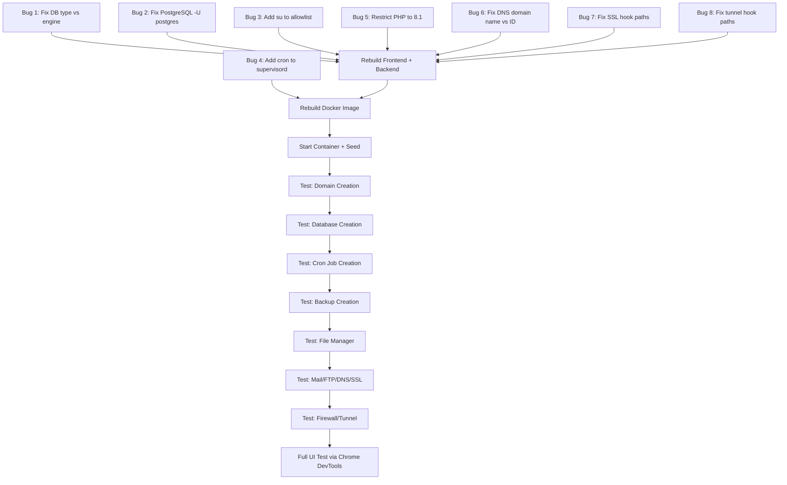

# NovaPanel Backend Testing & Fix Plan

## Executive Summary

After thorough analysis of the network log (26 API errors), all backend route files, service files, frontend hooks, and Docker configuration, I've identified **8 critical code bugs** and **4 Docker environment issues** that must be fixed before all features work correctly.

---

## Route Map (Backend Registration vs Frontend Hooks)

| Module | Backend Prefix | Internal Routes | Frontend Hook Path | Status |
|--------|---------------|-----------------|-------------------|--------|
| Auth | `/api/v1/auth` | `/login`, `/logout` | `/auth/login` | ✅ |
| Stats | `/api/v1/stats` | `/server`, `/services`, `/summary` | `/stats/server` | ✅ |
| Domains | `/api/v1/domains` | `/`, `/:id` | `/domains` | ✅ |
| Webserver | `/api/v1/webserver` | `/status`, `/vhost/:domain` | `/webserver/status` | ✅ |
| PHP | `/api/v1/php` | ... | `/php` | ✅ |
| SSL | `/api/v1/ssl` | `/domains/:id/ssl` | `/ssl` | ❌ Bug 7 |
| DNS | `/api/v1/dns` | `/domains/:id/dns` | `/dns/${domain}` | ❌ Bug 6 |
| Mail | `/api/v1/mail` | `/domains/:id/mail/...` | `/mail/domains/${id}/mail/...` | ✅ |
| Databases | `/api/v1/db` | `/databases` | `/db/databases` | ✅ |
| FTP | `/api/v1` | `/domains/:id/ftp` | `/domains/${id}/ftp` | ✅ |
| Files | `/api/v1` | `/files` | `/files` | ✅ |
| Logs | `/api/v1` | `/domains/:id/logs/...` | `/domains/${id}/logs/access` | ✅ |
| Cron | `/api/v1` | `/cron` | `/cron` | ✅ |
| Firewall | `/api/v1` | `/firewall/rules` | `/firewall/rules` | ✅ |
| Backup | `/api/v1` | `/backups` | `/backups` | ✅ |
| Audit | `/api/v1` | `/audit` | `/audit` | ✅ |
| Tunnel | `/api/v1` | `/tunnel/status` | `/tunnel` | ❌ Bug 8 |

---

## Critical Bugs to Fix

### Bug 1: Database Creation Field Mismatch — `type` vs `engine`

**Files:** `DatabasesPage.tsx`, `databases.ts`

**Problem:** Frontend sends `{ name, type: 'mysql' }` but backend expects `{ name, engine: 'mariadb' }`

**Fix:**
1. `DatabasesPage.tsx:16` — Change `dbForm` from `{ name, type: 'mysql' }` to `{ name, engine: 'mariadb' }`
2. `DatabasesPage.tsx:38-41` — Change select options from `mysql`/`postgresql` to `mariadb`/`postgresql`
3. `databases.ts:5` — Change `Database` interface: `type` → `engine`
4. `databases.ts:29` — Change mutation type: `type` → `engine`
5. `DatabasesPage.tsx:79` — Change `d.type` → `d.engine`

---

### Bug 2: PostgreSQL Commands Run as Root

**File:** `apps/api/src/services/postgres.service.ts`

**Problem:** All commands use `{ sudo: true, env: { USER: 'postgres' } }` but PostgreSQL uses OS user not env var → `role "root" does not exist`

**Fix:** Add `-U postgres` to all commands, remove `env: { USER: 'postgres' }`:
- `createdb -U postgres [name]`
- `dropdb -U postgres --if-exists [name]`
- `psql -U postgres -c "..."`
- `pg_dump -U postgres [name]`
- `dropuser -U postgres --if-exists [name]`
- `createuser: psql -U postgres -c "CREATE USER ..."`

---

### Bug 3: `su` Command Not in Executor Allowlist

**File:** `apps/api/src/services/executor.ts`

**Problem:** `cron.service.ts:103` calls `run('su', ...)` but `su` not in `ALLOWED_COMMANDS`

**Fix:** Add `'su'` to the `ALLOWED_COMMANDS` set

---

### Bug 4: Cron Daemon Not Running in Docker

**File:** `docker/supervisord.conf`

**Problem:** Cron daemon not listed in supervisord.conf, so crontab entries never execute

**Fix:** Add to supervisord.conf:
```ini
[program:cron]
command=/usr/sbin/cron -f
autostart=true
autorestart=true
priority=25
stdout_logfile=/var/log/supervisor/cron.log
```
Also ensure `cron` is installed in Dockerfile.

---

### Bug 5: PHP Version Mismatch — Only 8.1 Installed

**File:** `apps/web/src/pages/domains/DomainsPage.tsx`

**Problem:** Only PHP 8.1 FPM in Docker, but form offers 8.2/8.3/8.4 → vhost configs point to non-existent sockets

**Fix:** Restrict PHP options to only 8.1 in DomainsPage.tsx

---

### Bug 6: DNS Hooks Use Domain Name but Backend Uses Domain ID

**Files:** `dns.ts`, `DnsPage.tsx`

**Problem:**
- `DnsPage.tsx:28` — Dropdown value = `d.name` (domain name)
- `dns.ts:21` — Calls `/dns/${domain}` with domain name
- Backend routes: `/domains/:id/dns` — expects domain ID
- Frontend calls `/api/v1/dns/test.example.com` but backend expects `/api/v1/dns/domains/{id}/dns`

**Fix:**
1. `DnsPage.tsx:28` — Change `value={d.name}` to `value={d.id}`
2. `dns.ts:21` — Change `/dns/${domain}` to `/domains/${domain}/dns`
3. `dns.ts:30` — Change `/dns/${domain}/records` to `/domains/${domain}/dns/records`
4. `dns.ts:39` — Change `/dns/${domain}/records/${recordId}` to `/domains/${domain}/dns/records/${recordId}`
5. `dns.ts:48` — Same pattern for delete

---

### Bug 7: SSL Hooks Use Completely Wrong Paths

**Files:** `ssl.ts`, `SslPage.tsx`

**Problem:**
- Frontend calls `GET /ssl` — no such backend route (backend only has `GET /domains/:id/ssl`)
- Frontend calls `POST /ssl/letsencrypt` with `{ domain, email }` — backend expects `POST /domains/:id/letsencrypt`
- Frontend calls `POST /ssl/custom` — backend expects `POST /domains/:id/custom`
- Frontend calls `POST /ssl/selfsigned` — backend expects `POST /domains/:id/self-signed`
- Frontend calls `DELETE /ssl/${id}` — backend expects `DELETE /domains/:id`

**Fix:**
1. Add `GET /ssl` list-all endpoint to backend SSL routes
2. Change all frontend SSL hook paths to `/domains/${domainId}/ssl/...`
3. Update SslPage to use domain ID selector

---

### Bug 8: Tunnel Hooks Have Path and Field Mismatches

**File:** `apps/web/src/api/hooks/tunnel.ts`

**Problem:**
- Frontend calls `GET /tunnel` — backend has `GET /tunnel/status`
- Frontend sends `{ name, token }` — backend expects `{ name, apiToken, accountId }`
- Frontend calls `POST /tunnel/${id}/start` — backend has `POST /tunnel/start` (no ID)

**Fix:**
1. `useTunnels` — change to `/tunnel/status`
2. `useSetupTunnel` — change fields to `{ name, apiToken, accountId }`
3. `useStartTunnel` — change to `/tunnel/start`
4. `useStopTunnel` — change to `/tunnel/stop`

---

## Docker Environment Issues

1. **Cron not in supervisord** (Bug 4 above)
2. **Postfix reload via systemctl wrapper** — `mail.service.ts:35` calls `systemctl reload dovecot` which uses `supervisorctl restart` — could drop connections
3. **ProFTPd passwd file** — FTP service writes to `/etc/proftpd/ftpd.passwd` — verify ProFTPd config references it
4. **BIND zones directory** — `BIND_ZONES_DIR=/etc/bind/zones` — verify directory exists with correct permissions

---

## Implementation Order



---

## Files to Modify

| # | File | Change |
|---|------|--------|
| 1 | `apps/web/src/pages/databases/DatabasesPage.tsx` | `type` → `engine`, `mysql` → `mariadb` |
| 2 | `apps/web/src/api/hooks/databases.ts` | Interface + mutation `type` → `engine` |
| 3 | `apps/api/src/services/postgres.service.ts` | Add `-U postgres` to all commands |
| 4 | `apps/api/src/services/executor.ts` | Add `su` to `ALLOWED_COMMANDS` |
| 5 | `docker/supervisord.conf` | Add cron service |
| 6 | `apps/web/src/pages/domains/DomainsPage.tsx` | Restrict PHP to 8.1 only |
| 7 | `apps/web/src/api/hooks/dns.ts` | Fix paths: `/dns/${d}` → `/domains/${d}/dns` |
| 8 | `apps/web/src/pages/dns/DnsPage.tsx` | Use `d.id` instead of `d.name` in dropdown |
| 9 | `apps/web/src/api/hooks/ssl.ts` | Fix all paths to use `/domains/${id}/ssl/...` |
| 10 | `apps/web/src/pages/ssl/SslPage.tsx` | Use domain ID selector |
| 11 | `apps/api/src/modules/ssl/ssl.routes.ts` | Add `GET /` list-all endpoint |
| 12 | `apps/web/src/api/hooks/tunnel.ts` | Fix paths and field names |
| 13 | `Dockerfile` | Ensure cron is installed |

---

## Testing Plan (Per Module)

### Test 1: Domain Creation
```
POST /api/v1/domains { name: "test.example.com", phpVersion: "8.1" }
```
Verify: directory created, nginx vhost written, reload succeeds, DB record inserted

### Test 2: Database Creation
```
POST /api/v1/db/databases { name: "testdb", engine: "mariadb" }
```
Verify: MariaDB database created, DB record inserted, list returns it

### Test 3: Cron Job Creation
```
POST /api/v1/cron { schedule: "*/5 * * * *", command: "echo hello" }
```
Verify: crontab entry installed, DB record inserted, toggle works

### Test 4: Backup Creation
```
POST /api/v1/backups { type: "full" }
```
Verify: archive created, DB record with status "completed"

### Test 5: File Manager
```
GET /api/v1/files?path=/
POST /api/v1/files/mkdir { path: "/", name: "testdir" }
```
Verify: listing works, mkdir works, file read/save works

### Test 6: Mail Operations (requires domain)
```
POST /api/v1/mail/domains/{domainId}/mail/enable
POST /api/v1/mail/domains/{domainId}/mail/mailboxes { username, password, quotaMb }
```

### Test 7: FTP Operations (requires domain)
```
POST /api/v1/domains/{domainId}/ftp { username, password, homeDir }
```

### Test 8: DNS Records (requires domain)
```
GET /api/v1/dns/domains/{domainId}/dns
POST /api/v1/dns/domains/{domainId}/dns/records { type: "A", name: "www", value: "127.0.0.1" }
```

### Test 9: SSL Operations (requires domain)
```
POST /api/v1/ssl/domains/{domainId}/self-signed { days: 365 }
```

### Test 10: Firewall Operations
```
GET /api/v1/firewall/rules
POST /api/v1/firewall/rules { action: "allow", port: "8080", protocol: "tcp" }
```
