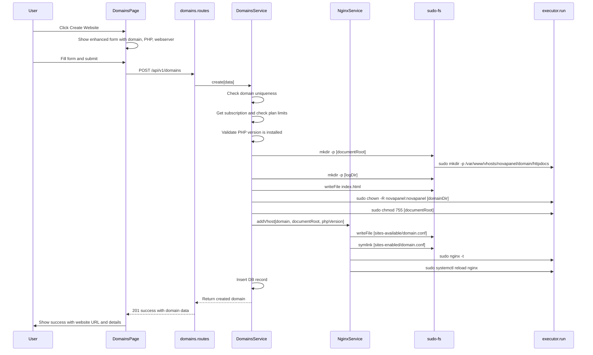

# Domain/Website Creation Fix Plan

## Problem Analysis

The domain creation flow has **6 critical bugs** that prevent it from creating a working website. The backend code structure is correct (creates directories, writes index.html, generates nginx vhost, reloads nginx), but several infrastructure and validation issues cause silent failures.

---

## Bug Analysis

### Bug 14: System User `admin` Does Not Exist

**Root Cause:**
- [`seed.ts`](apps/api/src/db/seed.ts:47) creates a subscription with `systemUser: 'admin'`
- The [`Dockerfile`](Dockerfile:53) only creates the `novapanel` user (`useradd -r -m -d /opt/novapanel -s /bin/bash novapanel`)
- No `admin` system user is ever created

**Impact:**
- [`domains.service.ts:105`](apps/api/src/modules/domains/domains.service.ts:105) runs `chown -R admin:admin ...` which **silently fails** (executor uses `reject: false`)
- All created files remain owned by `root` instead of the subscription user
- FTP, file manager, and PHP scripts cannot write to the domain directory

**Fix:** Change the seed to use `novapanel` as the system user (simplest, works immediately in Docker):
- `seed.ts`: Change `systemUser: 'admin'` → `systemUser: 'novapanel'`
- `seed.ts`: Change `homeDir: '/var/www/vhosts/admin'` → `homeDir: '/var/www/vhosts/novapanel'`
- `entrypoint.sh`: Change `mkdir -p /var/www/vhosts/admin` → `mkdir -p /var/www/vhosts/novapanel`

> **Note:** For production, each subscription should create its own system user via `useradd`. This can be added as a future enhancement.

---

### Bug 15: PHP Version Mismatch — Only 8.1 Installed

**Root Cause:**
- [`Dockerfile:37`](Dockerfile:37) only installs `php8.1-fpm` and `php8.1-*` extensions
- [`domains.schema.ts:6`](apps/api/src/modules/domains/domains.schema.ts:6) allows `['8.1', '8.2', '8.3', '8.4']`
- [`nginx.service.ts:179`](apps/api/src/services/nginx.service.ts:179) generates `fastcgi_pass unix:/run/php/php{version}-fpm.sock`
- Only `/run/php/php8.1-fpm.sock` exists

**Impact:**
- Domains created with PHP 8.2/8.3/8.4 will serve static HTML but return **502 Bad Gateway** for any `.php` file
- The nginx config test passes (syntax-only check), so the vhost is created successfully but broken at runtime

**Fix (two parts):**

**Part A — Backend validation:** Add a check in [`domains.service.ts`](apps/api/src/modules/domains/domains.service.ts:72) to verify the PHP-FPM socket exists before creating the vhost:
```typescript
// After line 72, before directory creation
if (phpVersion !== '8.1') {
  const socketCheck = await run('test', ['-S', `/run/php/php${phpVersion}-fpm.sock`], { sudo: true });
  if (!socketCheck.success) {
    throw new AppError(422, 'PHP_VERSION_NOT_AVAILABLE', 
      `PHP ${phpVersion} is not installed. Available: 8.1`);
  }
}
```

**Part B — Frontend restriction:** The PHP selector should only show installed versions. For Docker, only 8.1 is available. This ties into Bug 16.

---

### Bug 16: Frontend PHP Selector Only Shows 8.1

**Root Cause:**
- [`DomainsPage.tsx:49`](apps/web/src/pages/domains/DomainsPage.tsx:49) hardcodes `{['8.1'].map(...)}`
- The form state initializes to `phpVersion: '8.2'` (line 15) but the dropdown only shows 8.1
- Mismatch between displayed value and submitted value

**Fix:** Update the PHP version selector to show all schema-allowed versions:
```tsx
{['8.1', '8.2', '8.3', '8.4'].map((v) => (
  <option key={v} value={v}>PHP {v}</option>
))}
```
And fix the default to match: `const [form, setForm] = useState({ name: '', phpVersion: '8.1' });`

---

### Bug 17: Domain Creation Silently Ignores Command Failures

**Root Cause:**
- [`executor.ts:100`](apps/api/src/services/executor.ts:100) uses `reject: false` — execa never throws on non-zero exit
- [`domains.service.ts:105-106`](apps/api/src/modules/domains/domains.service.ts:105) calls `run('chown', ...)` and `run('chmod', ...)` without checking `.success`
- If `chown` fails (user doesn't exist), the error is silently swallowed

**Fix:** Add result checking after critical commands in [`domains.service.ts`](apps/api/src/modules/domains/domains.service.ts:96):
```typescript
// After chown
const chownResult = await run('chown', ['-R', ...], { sudo: true });
if (!chownResult.success) {
  logger.warn({ user: subscription.systemUser, stderr: chownResult.stderr }, 
    'chown failed — system user may not exist');
  // Non-fatal: files will be owned by root, still functional
}

// After chmod
const chmodResult = await run('chmod', ['755', documentRoot], { sudo: true });
if (!chmodResult.success) {
  throw new Error(`chmod failed: ${chmodResult.stderr}`);
}
```

---

### Bug 18: Frontend "Add Domain" Form Is Too Basic

**Current state:** The form at [`DomainsPage.tsx:34-63`](apps/web/src/pages/domains/DomainsPage.tsx:34) only has:
- Domain name input
- PHP version dropdown (broken — only shows 8.1)
- Create button

**Missing features for a proper "Create Website" flow:**
- Web server type selection (nginx / apache / nginx+apache)
- Document root path (auto-suggested, customizable)
- No success feedback with website URL
- No error display when creation fails

**Fix:** Enhance the form to include:
1. Domain name input
2. PHP version dropdown (all versions)
3. Web server type selector
4. Auto-suggested document root (read-only, showing the path that will be created)
5. Success message showing: website URL, document root path, and status
6. Error display for validation failures

---

### Bug 19: Default index.html Is Too Minimal

**Current state** at [`domains.service.ts:315-324`](apps/api/src/modules/domains/domains.service.ts:315):
```html
<!DOCTYPE html>
<html>
<head><title>Welcome to ${domain}</title></head>
<body>
  <h1>Success! ${domain} is working</h1>
  <p>Managed by ServerForge</p>
</body>
</html>
```

**Fix:** Create a proper branded welcome page with:
- NovaPanel branding
- CSS styling (inline, no external deps)
- Links to common actions (upload files, manage SSL, etc.)
- PHP info link (to verify PHP is working)

---

## Flow Diagram — Fixed Domain Creation



---

## Files to Modify

| File | Change |
|------|--------|
| [`apps/api/src/db/seed.ts`](apps/api/src/db/seed.ts:47) | Change `systemUser: 'admin'` → `'novapanel'`, `homeDir` accordingly |
| [`docker/entrypoint.sh`](docker/entrypoint.sh:56) | Change `mkdir -p /var/www/vhosts/admin` → `/var/www/vhosts/novapanel` |
| [`apps/api/src/modules/domains/domains.service.ts`](apps/api/src/modules/domains/domains.service.ts:65) | Add PHP version validation, add run() result checking, improve default index.html |
| [`apps/web/src/pages/domains/DomainsPage.tsx`](apps/web/src/pages/domains/DomainsPage.tsx:34) | Enhance form with webserver selector, fix PHP versions, add success/error feedback |
| [`apps/web/src/api/hooks/domains.ts`](apps/web/src/api/hooks/domains.ts:29) | Update create mutation type to include webServer field |

---

## Implementation Order

1. **Bug 14** — Fix system user (seed.ts + entrypoint.sh) — unblocks everything else
2. **Bug 17** — Add error checking for run() results — prevents silent failures
3. **Bug 15** — Add PHP version validation — prevents broken vhosts
4. **Bug 16** — Fix frontend PHP selector — quick fix
5. **Bug 18** — Enhance frontend form — proper UX
6. **Bug 19** — Improve default index.html — polish
7. **Rebuild + test** — Verify end-to-end in Docker
