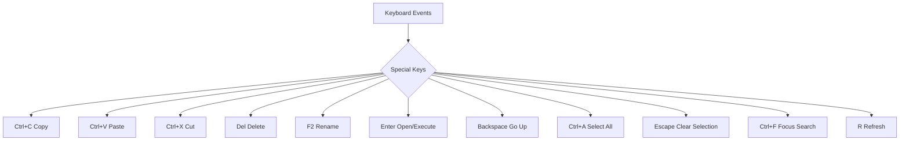

# File Manager Enhancement Plan

## Executive Summary

The [`FilesPage.tsx`](apps/web/src/pages/files/FilesPage.tsx:1) (1037 lines) provides solid foundation for file management with directory listing, search, sorting, permissions, and basic operations. This plan identifies **high-value enhancements** that would significantly improve usability for server administrators.

---

## Feature Analysis Matrix

| Feature | Priority | Complexity | User Impact | Effort |
|---------|----------|------------|-------------|--------|
| Keyboard Shortcuts | **HIGH** | Easy | High | Low |
| Debounced Search | **HIGH** | Easy | Medium | Low |
| Double-click to Open | **HIGH** | Easy | High | Low |
| Refresh Button | **HIGH** | Easy | High | Low |
| View Mode Toggle (Grid/List) | **MEDIUM** | Medium | Medium | Medium |
| File Details Panel | **MEDIUM** | Medium | High | Medium |
| Editable Path Bar | **MEDIUM** | Medium | High | Medium |
| Drag-and-Drop File Movement | **MEDIUM** | Hard | High | High |
| File Type Filtering | **MEDIUM** | Easy | Medium | Low |
| Batch Rename | **LOW** | Hard | High | High |
| Favorites/Bookmarks | **LOW** | Medium | Medium | Medium |
| Terminal Quick Access | **LOW** | Hard | Medium | High |

---

## Top 5 Priority Enhancements

### 1. Keyboard Shortcuts ⭐ HIGH PRIORITY

**Current State:** No keyboard navigation  
**Target State:** Full keyboard accessibility



**Implementation Approach:**
```typescript
// Add useEffect in FilesPage.tsx
useEffect(() => {
  const handleKeyDown = (e: KeyboardEvent) => {
    // Skip if in input field
    if (e.target instanceof HTMLInputElement || e.target instanceof HTMLTextAreaElement) return;
    
    if (e.ctrlKey || e.metaKey) {
      switch(e.key.toLowerCase()) {
        case 'c': e.preventDefault(); handleCopySelected(); break;
        case 'v': e.preventDefault(); handlePaste(); break;
        case 'x': e.preventDefault(); handleCutSelected(); break;
        case 'a': e.preventDefault(); selectAll(); break;
        case 'f': e.preventDefault(); searchInputRef.current?.focus(); break;
      }
    }
    
    switch(e.key) {
      case 'Delete': e.preventDefault(); handleBulkDelete(); break;
      case 'F2': e.preventDefault(); if (selectedItems.size === 1) startRename(); break;
      case 'Enter': e.preventDefault(); openSelected(); break;
      case 'Backspace': e.preventDefault(); navigateUp(); break;
      case 'r': if (!e.ctrlKey) { e.preventDefault(); refetch(); } break;
      case 'Escape': e.preventDefault(); clearSelection(); break;
    }
  };
  
  window.addEventListener('keydown', handleKeyDown);
  return () => window.removeEventListener('keydown', handleKeyDown);
}, [selectedItems, clipboard]);
```

**Files to Modify:**
- `apps/web/src/pages/files/FilesPage.tsx` (~50 lines additions)

---

### 2. Debounced Search + File Type Filtering ⭐ HIGH PRIORITY

**Current State:** Search filters on every keystroke, no type filtering  
**Target State:** Debounced search (300ms) + file extension filter dropdown

**Implementation Approach:**

```typescript
// Add debounce utility
const debouncedSearch = useMemo(() => {
  let timeout: NodeJS.Timeout;
  return (value: string) => {
    clearTimeout(timeout);
    timeout = setTimeout(() => setSearch(value), 300);
  };
}, []);
```

```typescript
// Add filter state
const [typeFilter, setTypeFilter] = useState<string>('');

// Type filter options derived from current directory
const availableTypes = useMemo(() => {
  const types = new Set(items.map(i => i.name.split('.').pop()?.toLowerCase() || 'folder'));
  return ['', ...Array.from(types)];
}, [items]);

// Filtered items
const filtered = useMemo(() => {
  let result = items;
  if (search) result = result.filter(i => i.name.toLowerCase().includes(search.toLowerCase()));
  if (typeFilter) result = result.filter(i => i.name.endsWith('.' + typeFilter));
  return result;
}, [items, search, typeFilter]);
```

**UI Addition:** Add dropdown filter button next to search:

```tsx
<select value={typeFilter} onChange={(e) => setTypeFilter(e.target.value)} 
        className="rounded-md border border-input bg-background px-3 py-2 text-sm">
  <option value="">All Types</option>
  {availableTypes.filter(Boolean).map(ext => (
    <option key={ext} value={ext}>.{ext}</option>
  ))}
</select>
```

**Files to Modify:**
- `apps/web/src/pages/files/FilesPage.tsx` (~30 lines additions)

---

### 3. Refresh Button + Auto-Refresh Indicator ⭐ HIGH PRIORITY

**Current State:** No refresh capability without page reload  
**Target State:** Manual refresh button + loading indicator

**Changes to Toolbar:**
```tsx
<button onClick={() => refetch()} 
        className="rounded-md border border-border px-3 py-2 text-sm hover:bg-accent flex items-center gap-1"
        disabled={isLoading}>
  <RefreshCw className={`h-4 w-4 ${isLoading ? 'animate-spin' : ''}`} /> 
  {isLoading ? 'Loading...' : 'Refresh'}
</button>
```

**Add Query Options for Refetch:**
The existing `useDirectoryListing` and `useDirectoryTree` already support refetch. Just need to expose the refetch function and add loading state.

**Files to Modify:**
- `apps/web/src/pages/files/FilesPage.tsx` (~10 lines additions)

---

### 4. Double-click to Open/Directories ⭐ HIGH PRIORITY

**Current State:** Single click selects, chevron button navigates into folders  
**Target State:** Double-click opens folders, single click selects

**Implementation Approach:**

```typescript
// Add double-click handler
const handleDoubleClick = (entry: FileEntry, e: React.MouseEvent) => {
  e.preventDefault();
  if (entry.isDirectory) {
    navigateTo(`${currentPath === '/' ? '' : currentPath}/${entry.name}`);
  } else {
    handleEdit(entry);
  }
};

// Update table row
<tr
  onDoubleClick={() => handleDoubleClick(entry, e)}
  onClick={() => toggleSelectItem(entry)}
  // ... existing props
>
```

**Files to Modify:**
- `apps/web/src/pages/files/FilesPage.tsx` (~15 lines additions)

---

### 5. View Mode Toggle (Grid/List) ⭐ MEDIUM PRIORITY

**Current State:** List view only  
**Target State:** Toggle between grid (visual) and list (detailed) views

**Component Structure:**
```typescript
const [viewMode, setViewMode] = useState<'list' | 'grid'>(() => 
  localStorage.getItem('files_viewMode') as 'list' | 'grid' || 'list'
);

// Save preference
useEffect(() => { localStorage.setItem('files_viewMode', viewMode); }, [viewMode]);
```

**Grid View Component:**
```tsx
function GridView({ items, onSelect, onOpen, onContextMenu, selectedItems }) {
  return (
    <div className="grid grid-cols-[repeat(auto-fill,minmax(120px,1fr))] gap-4 p-4">
      {items.map(entry => (
        <div
          key={entry.name}
          onClick={() => onSelect(entry)}
          onDoubleClick={() => onOpen(entry)}
          onContextMenu={(e) => onContextMenu(e, entry)}
          className={`flex flex-col items-center p-3 rounded-lg border cursor-pointer hover:bg-accent
            ${selectedItems.has(entryPath) ? 'border-primary bg-primary/10' : 'border-border'}`}
        >
          <div className="h-12 w-12 flex items-center justify-center">
            {getIcon(entry)}
          </div>
          <span className="text-xs text-center mt-2 truncate w-full" title={entry.name}>
            {entry.name}
          </span>
          <span className="text-[10px] text-muted-foreground">
            {entry.isDirectory ? 'Folder' : formatSize(entry.size)}
          </span>
        </div>
      ))}
    </div>
  );
}
```

**Toggle Button:**
```tsx
<button onClick={() => setViewMode(v => v === 'list' ? 'grid' : 'list')}
        className="rounded-md border border-border px-3 py-2 text-sm hover:bg-accent">
  {viewMode === 'list' ? <LayoutGrid className="h-4 w-4" /> : <List className="h-4 w-4" />}
</button>
```

**Files to Modify:**
- `apps/web/src/pages/files/FilesPage.tsx` (~80 lines additions)

---

## Additional Medium-Priority Enhancements

### 6. Editable Path Bar

**Target:** Direct path input for quick navigation

```tsx
// Replace breadcrumb display with editable input
<div className="flex items-center gap-1 border-b border-border pb-2">
  <Folder className="h-4 w-4 text-muted-foreground" />
  <input
    value={currentPath}
    onChange={(e) => setPathInput(e.target.value)}
    onBlur={() => navigateTo(pathInput)}
    onKeyDown={(e) => e.key === 'Enter' && navigateTo(pathInput)}
    className="flex-1 bg-transparent text-sm font-mono outline-none"
  />
</div>
```

### 7. File Details Panel (Slide-out)

**Target:** Show extended info for selected file(s)

```tsx
// Add state
const [showDetails, setShowDetails] = useState(false);

// Details Panel Component
function DetailsPanel({ entry, onClose }) {
  return (
    <div className="w-72 border-l border-border bg-card p-4 overflow-y-auto">
      <div className="flex justify-between items-center mb-4">
        <h3 className="font-semibold">Details</h3>
        <button onClick={onClose}><X className="h-4 w-4" /></button>
      </div>
      <div className="space-y-3 text-sm">
        <DetailRow label="Name" value={entry.name} />
        <DetailRow label="Type" value={entry.isDirectory ? 'Folder' : entry.type} />
        <DetailRow label="Size" value={formatSize(entry.size)} />
        <DetailRow label="Modified" value={new Date(entry.modifiedAt).toLocaleString()} />
        <DetailRow label="Permissions" value={entry.permissions} mono />
        <DetailRow label="Owner" value={`${entry.owner}:${entry.group}`} />
        <DetailRow label="Path" value={entry.path} mono breakAll />
      </div>
    </div>
  );
}
```

---

## Implementation Phases

### Phase 1: Quick Wins (1-2 sessions)
- [ ] Keyboard shortcuts
- [ ] Debounced search
- [ ] File type filtering
- [ ] Refresh button
- [ ] Double-click to open

### Phase 2: UI Improvements (2-3 sessions)
- [ ] View mode toggle (grid/list)
- [ ] Editable path bar
- [ ] File details panel

### Phase 3: Advanced Features (3-4 sessions)
- [ ] Drag-and-drop file movement
- [ ] Batch rename
- [ ] Favorites/bookmarks
- [ ] Upload progress improvements

---

## Recommended Implementation Order

1. **Keyboard Shortcuts** - Immediate productivity boost, low risk
2. **Debounced Search + Type Filter** - Improves search UX, trivial complexity
3. **Refresh Button** - Simple but high value
4. **Double-click Navigation** - Natural file manager behavior
5. **View Mode Toggle** - Visual preference, moderate effort

---

## Technical Considerations

### State Management
- Most features use local state (`useState`) - appropriate for UI-only features
- View mode preference persists to `localStorage`
- Keyboard shortcuts require careful event handling to avoid conflicts

### API Impact
- **Refresh** uses existing `refetch()` from TanStack Query
- **Type filtering** is client-side only (no API changes)
- **Search debounce** reduces API calls (improves performance)

### Performance
- Debounced search reduces re-renders during typing
- Grid view may need virtualization for large directories (>100 items)
- Consider `React.memo` for file row components

---

## Dependencies & Prerequisites

**No new dependencies required.** All enhancements use:
- React hooks (built-in)
- Existing `useDirectoryListing`, `useDirectoryTree` hooks
- Existing `localStorage` pattern for preferences
- Lucide icons (already imported)

---

## Risk Assessment

| Feature | Risk | Mitigation |
|---------|------|-----------|
| Keyboard shortcuts | Low - may conflict with browser defaults | Careful key detection, skip inputs |
| View mode toggle | Low - CSS changes only | Test both views thoroughly |
| Drag-and-drop | Medium - requires significant refactor | Implement in later phase |
| Double-click | Low - additive behavior | Works alongside single-click select |