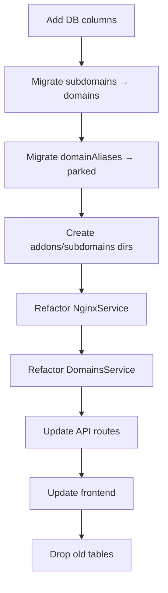

# NovaPanel v3 Architecture — Implementation Plan

> **Reference:** [`docs/dd.md`](docs/dd.md) — Domain & Website Architecture Plan (v3 Final)

---

## 1. Gap Analysis

### 1.1 Database Schema Gaps

| Current | v3 Plan | Action |
|---------|---------|--------|
| `websites.documentRoot` | `websites.homeDir` | Rename column; add `addons/` + `subdomains/` subdir logic |
| No `isPrimary` column | `domains.isPrimary` + partial unique index | Add column + migration |
| No `suspendedConfig` | `domains.suspendedConfig` | Add column |
| `type` enum: `primary\|subdomain\|alias\|redirect\|parked\|mail-only` | Same | Rename `alias` → `addon` |
| Separate `subdomains` table | `domains.type='subdomain'` with `parentDomainId` | Migrate → unified table |
| Separate `domainAliases` table | `domains.type='parked'` with `parentDomainId` | Migrate → unified table |

### 1.2 Nginx Service Gaps

| Current | v3 Plan | Action |
|---------|---------|--------|
| One config per domain | Website-scoped: one conf per website | Refactor `generateWebsiteConfig` |
| No domain-type awareness | Primary → addon → parked → subdomain blocks | Add type-aware config builder |
| Parked via `domainAliases` table | Parked merged into primary's `server_name` | Remove alias approach, use type |
| Generic PHP-FPM socket | Per-domain or per-website pool naming | Add `{websiteId}` suffix to socket |
| Full-website suspend only | Single domain suspend (503 block) | Add `generateSingleDomainSuspendedConfig` |
| `documentRoot` is per-domain | Primary → `httpdocs/`, addon → `addons/{id}/httpdocs` | Compute docroot by type |

### 1.3 Domain Service Gaps

| Current | v3 Plan | Action |
|---------|---------|--------|
| No `makePrimary` | `POST /domains/:id/make-primary` | Implement promotion logic |
| No `isPrimary` tracking | Primary flag on domain | Add flag management |
| Parked via `domainAliases` | Parked as `type='parked'` | Migrate parked handling |
| Subdomains in separate table | Subdomains in `domains` table | Migrate subdomain records |
| No `suspendedConfig` storage | Store 503 block on domain row | Add column + storage logic |

---

## 2. Migration Steps (in order)



---

## 3. Todo List

- [ ] **3.1 Database Migration — Add new columns**
  - Add `websites.homeDir` column (rename from `documentRoot`)
  - Add `domains.isPrimary` column (INTEGER DEFAULT 0)
  - Add `domains.suspendedConfig` column (TEXT, nullable)
  - Create partial unique index: `idx_domains_one_primary_per_website`
  - Add `addons/` and `subdomains/` subdirs creation to website creation

- [ ] **3.2 Database Migration — Merge subdomains into domains**
  - Insert `domains` rows with `type='subdomain'` for each `subdomains` row
  - Set `parentDomainId` to parent domain id
  - Set `websiteId` from subdomain's `websiteId` or inherit from parent domain
  - Drop `subdomains` table (after verification)

- [ ] **3.3 Database Migration — Merge domainAliases into domains**
  - Insert `domains` rows with `type='parked'` for each `domainAliases` row
  - Set `parentDomainId` to the aliased domain id
  - Drop `domainAliases` table (after verification)

- [ ] **3.4 NginxService — Website-scoped config refactor**
  - Refactor `generateWebsiteConfig` to build type-aware server blocks
  - Primary domain → `server_name primary + parked domains`
  - Addon domain → own server block with `addons/{id}/httpdocs`
  - Subdomain → own server block with `subdomains/{id}/httpdocs`
  - Parked domains merged into primary's `server_name` line
  - Update PHP-FPM socket path to include `{websiteId}` suffix

- [ ] **3.5 NginxService — Single domain suspension**
  - Add `generateSingleDomainSuspendedConfig(domainId)` method
  - Store original server block in `domains.suspendedConfig`
  - Insert 503 block for that domain only within website conf
  - On activate: restore from `suspendedConfig` and regenerate

- [ ] **3.6 DomainsService — Primary promotion**
  - Add `makePrimary(domainId)` method
  - Demote current primary to addon
  - Promote target addon to primary
  - Reparent parked domains to new primary
  - Regenerate website conf

- [ ] **3.7 API Routes — Add make-primary endpoint**
  - Add `POST /api/v1/domains/:id/make-primary` route
  - Validate domain is addon type
  - Call `DomainsService.makePrimary`

- [ ] **3.8 Frontend — Update domain UI**
  - Show domain type badges (Primary/Addon/Parked/Subdomain)
  - Add "Make Primary" action for addon domains
  - Update domain detail panel tabs by type

- [ ] **3.9 Directory Structure — Create addons/subdomains dirs**
  - Create `addons/` and `subdomains/` under each website home
  - Update document root logic per domain type
  - Migrate existing subdomain files to new paths

---

## 4. Key Implementation Details

### 4.1 isPrimary Partial Unique Index SQL

```sql
CREATE UNIQUE INDEX idx_domains_one_primary_per_website
  ON domains (websiteId)
  WHERE isPrimary = 1 AND websiteId IS NOT NULL;
```

### 4.2 makePrimary Transaction Flow

```
1. BEGIN TRANSACTION
2. Find current primary → SET isPrimary=0, type='addon'
3. Find target domain → SET isPrimary=1, type='primary'
4. Reparent parked domains: parentDomainId = newPrimaryId
5. COMMIT
6. Regenerate website conf
```

### 4.3 Single Domain Suspend Flow

```
1. Read domain's normal server block from memory/DB
2. Store in domains.suspendedConfig
3. Replace domain's server block with 503 block in website conf
4. nginx -t && reload
```

### 4.4 Parked Domain SSL Handling

When a parked domain is added to a website with SSL:
- Expand the primary SSL cert via certbot `--expand` to include parked names
- Regenerate website conf with same `ssl_certificate` path

---

## 5. Backward Compatibility Notes

- Legacy `subdomains` and `domainAliases` tables must be migrated before dropping
- Old per-domain nginx configs should be cleaned up during migration
- `documentRoot` on domains table becomes nullable for parked/redirect/mail-only types
- PHP inheritance (NULL = use website default) must work across all domain types
