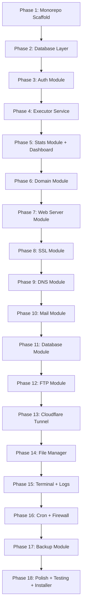
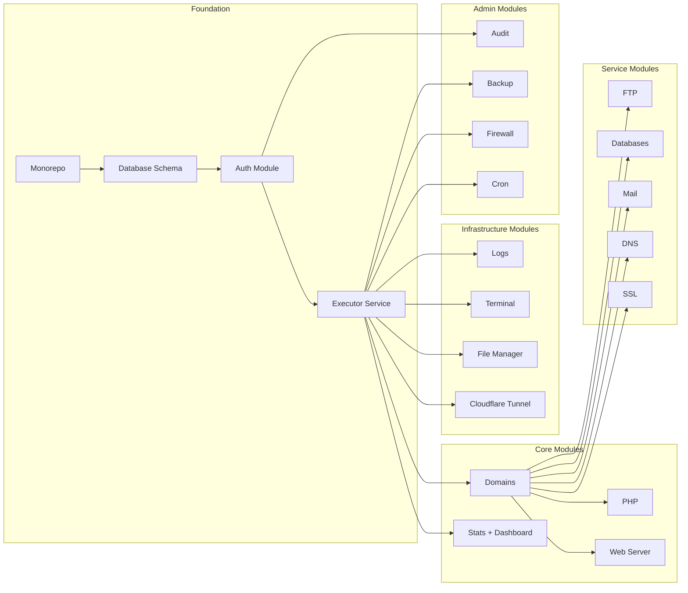

# ServerForge — Full Implementation Plan

> **Derived from:** `server-panel-plan.md`
> **Project:** NovaPanel / ServerForge
> **Purpose:** Granular, step-by-step implementation checklist for AI coding agents

---

## Implementation Order Diagram

---

## Phase 1 — Monorepo Scaffold

### 1.1 Initialize Root Workspace
- [ ] Create root `package.json` with name `serverforge`, set `"private": true`
- [ ] Create `pnpm-workspace.yaml` referencing `apps/*`
- [ ] Create `turbo.json` with `build`, `dev`, `lint`, `test` pipelines
- [ ] Create root `.gitignore` covering `node_modules`, `dist`, `.env`, `*.sqlite`
- [ ] Create root `.env.example` with all env vars from spec section 14
- [ ] Create root `.nvmrc` with `20`

### 1.2 Scaffold API App (`apps/api/`)
- [ ] Create `apps/api/package.json` with dependencies:
  - `fastify`, `@fastify/cors`, `@fastify/helmet`, `@fastify/csrf-protection`, `@fastify/rate-limit`, `@fastify/cookie`, `@fastify/static`, `@fastify/websocket`, `@fastify/multipart`
  - `drizzle-orm`, `@libsql/client`
  - `bullmq`, `ioredis`
  - `execa`, `node-ssh`, `node-pty`
  - `lucia`, `@lucia/adapter-sqlite`
  - `zod`, `handlebars`, `nanoid`, `pino`, `argon2`, `otpauth`
  - Dev: `typescript`, `drizzle-kit`, `vitest`, `@types/node`, `tsx`
- [ ] Create `apps/api/tsconfig.json` with strict mode, paths alias `@/*` → `src/*`
- [ ] Create `apps/api/src/index.ts` — entry point that imports and starts server
- [ ] Create `apps/api/src/server.ts` — Fastify instance factory:
  - Register CORS, helmet, cookie, rate-limit plugins
  - Register multipart with size limits
  - Register static serving from `../../apps/web/dist`
  - Register WebSocket plugin
  - Mount API routes under `/api/v1`
  - Add global error handler returning standard envelope
  - Add 404 catch-all for SPA fallback
- [ ] Create `apps/api/src/config/env.ts` — Zod-validated env config schema
- [ ] Create `apps/api/src/config/constants.ts` — app constants like `SF_VERSION`, `ROLES`

### 1.3 Scaffold Web App (`apps/web/`)
- [ ] Create `apps/web/` using Vite + React + TypeScript template
- [ ] Install dependencies: `react`, `react-dom`, `@tanstack/react-router`, `@tanstack/react-query`, `zustand`, `react-hook-form`, `@hookform/resolvers`, `zod`, `recharts`, `xterm`, `@xterm/addon-fit`, `@xterm/addon-web-links`, `lucide-react`
- [ ] Install `tailwindcss`, `postcss`, `autoprefixer`, `class-variance-authority`, `clsx`, `tailwind-merge`
- [ ] Initialize shadcn/ui with `npx shadcn@latest init`
- [ ] Add base shadcn components: `button`, `input`, `label`, `card`, `dialog`, `dropdown-menu`, `table`, `tabs`, `badge`, `toast`, `sheet`, `select`, `switch`, `separator`, `avatar`, `skeleton`, `alert`, `tooltip`
- [ ] Create `apps/web/src/lib/utils.ts` — cn helper
- [ ] Create `apps/web/src/lib/constants.ts` — API base URL, routes
- [ ] Create `apps/web/src/api/client.ts` — fetch wrapper with auth headers, error handling, base URL
- [ ] Create `apps/web/vite.config.ts` with API proxy to `localhost:8443`

### 1.4 Verify Workspace
- [ ] Run `pnpm install` at root — confirm both workspaces resolve
- [ ] Run `pnpm --filter api dev` — confirm Fastify starts on port 8443
- [ ] Run `pnpm --filter web dev` — confirm Vite dev server starts
- [ ] Confirm Turborepo pipeline works: `pnpm turbo build`

---

## Phase 2 — Database Layer

### 2.1 Drizzle Setup
- [ ] Create `apps/api/src/db/index.ts` — Drizzle client using `@libsql/client` with WAL mode
- [ ] Create `apps/api/drizzle.config.ts` — Drizzle Kit config pointing to schema dir

### 2.2 Schema Files (one file per table)
- [ ] Create `apps/api/src/db/schema/users.ts` — `users` and `sessions` tables per spec 5.1
- [ ] Create `apps/api/src/db/schema/subscriptions.ts` — `plans` and `subscriptions` tables per spec 5.2
- [ ] Create `apps/api/src/db/schema/domains.ts` — `domains`, `subdomains`, `domainAliases`, `domainRedirects` tables per spec 5.3
- [ ] Create `apps/api/src/db/schema/ssl.ts` — `sslCertificates` table per spec 5.4
- [ ] Create `apps/api/src/db/schema/databases.ts` — `databases` and `databaseUsers` tables per spec 5.5
- [ ] Create `apps/api/src/db/schema/email.ts` — `mailDomains`, `mailboxes`, `mailAliases`, `mailForwards` tables per spec 5.6
- [ ] Create `apps/api/src/db/schema/dns.ts` — `dnsZones` and `dnsRecords` tables per spec 5.7
- [ ] Create `apps/api/src/db/schema/ftp.ts` — `ftpAccounts` table per spec 5.8
- [ ] Create `apps/api/src/db/schema/cron.ts` — `cronJobs` table per spec 5.9
- [ ] Create `apps/api/src/db/schema/tunnels.ts` — `cloudflareTunnels` and `tunnelRoutes` tables per spec 5.10
- [ ] Create `apps/api/src/db/schema/audit.ts` — `auditLogs` table per spec 5.11
- [ ] Create `apps/api/src/db/schema/stats.ts` — `serverStats` table for rolling 24h metrics
- [ ] Create `apps/api/src/db/schema/backups.ts` — `backups` and `backupSchedules` tables
- [ ] Create `apps/api/src/db/schema/index.ts` — barrel export of all schemas

### 2.3 Migrations
- [ ] Run `pnpm drizzle-kit generate` to create initial migration SQL
- [ ] Create `apps/api/src/db/seed.ts` — seed script:
  - Create default `admin` user with hashed password from `ADMIN_PASSWORD` env
  - Create default plan with unlimited resources
  - Create default subscription for admin
- [ ] Run migration + seed to verify schema creates correctly

---

## Phase 3 — Auth Module

### 3.1 Auth Service (`apps/api/src/modules/auth/`)
- [ ] Create `apps/api/src/modules/auth/auth.schema.ts` — Zod schemas:
  - `loginSchema`: username + password
  - `registerSchema`: username + email + password + confirmPassword
  - `enable2faSchema`: code
  - `verify2faSchema`: code
  - `resetPasswordSchema`: email
- [ ] Create `apps/api/src/modules/auth/auth.service.ts`:
  - `login(username, password)` — verify credentials with Argon2id, check 2FA, create Lucia session
  - `logout(sessionId)` — invalidate session
  - `refresh(sessionId)` — extend session expiry
  - `enable2FA(userId)` — generate TOTP secret, return QR code URI
  - `verify2FA(userId, code)` — verify TOTP code, enable 2FA flag
  - `generateApiToken(userId)` — create `sf_` prefixed token, store SHA256 hash
  - `validateApiToken(token)` — lookup by SHA256 hash
  - `getMe(userId)` — return user profile
- [ ] Create `apps/api/src/modules/auth/auth.middleware.ts`:
  - `requireAuth` — check session cookie or Bearer token
  - `requireRole(...roles)` — RBAC check middleware
  - `optionalAuth` — attach user if present, don't block
- [ ] Create `apps/api/src/modules/auth/auth.routes.ts`:
  - `POST /api/v1/auth/login` — rate limited to 5/15min
  - `POST /api/v1/auth/logout`
  - `POST /api/v1/auth/refresh`
  - `POST /api/v1/auth/2fa/enable` — requireAuth
  - `POST /api/v1/auth/2fa/verify` — requireAuth
  - `POST /api/v1/auth/password/reset`
  - `GET /api/v1/auth/me` — requireAuth
- [ ] Register auth routes in `server.ts`

### 3.2 User Management Module (`apps/api/src/modules/users/`)
- [ ] Create `apps/api/src/modules/users/users.schema.ts` — CRUD Zod schemas
- [ ] Create `apps/api/src/modules/users/users.service.ts`:
  - `listUsers(filters, pagination)` — with role filter
  - `getUser(id)`
  - `createUser(data)` — admin/reseller only
  - `updateUser(id, data)`
  - `deleteUser(id)` — cascade cleanup
  - `changePassword(userId, oldPassword, newPassword)`
- [ ] Create `apps/api/src/modules/users/users.routes.ts`:
  - `GET /api/v1/users` — admin only, paginated
  - `POST /api/v1/users` — admin only
  - `GET /api/v1/users/:id` — owner or admin
  - `PUT /api/v1/users/:id` — owner or admin
  - `DELETE /api/v1/users/:id` — admin only

### 3.3 Plans and Subscriptions (`apps/api/src/modules/subscriptions/`)
- [ ] Create `apps/api/src/modules/subscriptions/subscriptions.schema.ts`
- [ ] Create `apps/api/src/modules/subscriptions/subscriptions.service.ts`:
  - CRUD for plans
  - CRUD for subscriptions
  - `checkLimit(subscriptionId, resourceType)` — enforce plan limits
- [ ] Create `apps/api/src/modules/subscriptions/subscriptions.routes.ts`:
  - `GET /api/v1/plans`
  - `POST /api/v1/plans` — admin
  - `PUT /api/v1/plans/:id` — admin
  - `DELETE /api/v1/plans/:id` — admin
  - `GET /api/v1/subscriptions`
  - `POST /api/v1/subscriptions` — admin/reseller
  - `PUT /api/v1/subscriptions/:id`
  - `DELETE /api/v1/subscriptions/:id` — admin

### 3.4 Frontend Auth Pages
- [ ] Create `apps/web/src/store/auth.store.ts` — Zustand store for auth state
- [ ] Create `apps/web/src/api/hooks/auth.ts` — TanStack Query hooks:
  - `useLogin()`, `useLogout()`, `useMe()`, `use2FA()`
- [ ] Create `apps/web/src/pages/login/LoginPage.tsx` — login form with username/password, 2FA step
- [ ] Create auth guard component for protected routes
- [ ] Create `apps/web/src/router.tsx` — TanStack Router with:
  - Public routes: `/login`
  - Protected routes: `/`, `/domains`, `/domains/:id`, etc.
  - Route loader that checks auth state

---

## Phase 4 — Executor Service

### 4.1 Core Executor
- [ ] Create `apps/api/src/services/executor.ts`:
  - `ALLOWED_COMMANDS` Set with all permitted binaries
  - `sanitizeArg(arg)` — strip shell metacharacters
  - `run(cmd, args, options?)` — execa wrapper with allowlist check
  - `runUnsafe(cmd, args)` — for trusted internal use, logged at WARN
- [ ] Create `apps/api/src/utils/crypto.ts`:
  - `hashPassword(password)` — Argon2id
  - `verifyPassword(hash, password)`
  - `encrypt(plaintext)` — AES-256-GCM using `SF_ENCRYPTION_KEY`
  - `decrypt(ciphertext)`
  - `generateToken(prefix)` — random hex token
  - `hashToken(token)` — SHA256
- [ ] Create `apps/api/src/utils/ip.ts` — IP validation helpers
- [ ] Create `apps/api/src/utils/validators.ts` — domain name regex, email, cron expression validators

### 4.2 System Service Classes
- [ ] Create `apps/api/src/services/nginx.service.ts` — implements `SystemService` interface for Nginx
- [ ] Create `apps/api/src/services/apache.service.ts` — implements `SystemService` for Apache2
- [ ] Create `apps/api/src/services/php-fpm.service.ts` — PHP-FPM pool management
- [ ] Create `apps/api/src/services/postfix.service.ts` — Postfix management
- [ ] Create `apps/api/src/services/dovecot.service.ts` — Dovecot management
- [ ] Create `apps/api/src/services/bind.service.ts` — BIND9 zone management
- [ ] Create `apps/api/src/services/mariadb.service.ts` — MariaDB user/DB management
- [ ] Create `apps/api/src/services/postgres.service.ts` — PostgreSQL user/DB management
- [ ] Create `apps/api/src/services/certbot.service.ts` — Let's Encrypt operations
- [ ] Create `apps/api/src/services/ufw.service.ts` — UFW rule management
- [ ] Create `apps/api/src/services/fail2ban.service.ts` — Fail2Ban operations
- [ ] Create `apps/api/src/services/cloudflared.service.ts` — Cloudflare tunnel management
- [ ] Create `apps/api/src/services/proftpd.service.ts` — ProFTPd account management

### 4.3 Config Templates
- [ ] Create `apps/api/src/templates/nginx/vhost.conf.hbs`
- [ ] Create `apps/api/src/templates/nginx/vhost-ssl.conf.hbs`
- [ ] Create `apps/api/src/templates/nginx/proxy.conf.hbs`
- [ ] Create `apps/api/src/templates/apache/vhost.conf.hbs`
- [ ] Create `apps/api/src/templates/apache/vhost-ssl.conf.hbs`
- [ ] Create `apps/api/src/templates/bind/zone.hbs`
- [ ] Create `apps/api/src/templates/postfix/main.cf.hbs`
- [ ] Create `apps/api/src/templates/php-fpm/pool.conf.hbs`
- [ ] Create template rendering utility using Handlebars

---

## Phase 5 — Stats Module + Dashboard

### 5.1 Stats Backend
- [ ] Create `apps/api/src/modules/stats/stats.service.ts`:
  - `getServerStats()` — CPU, RAM, disk, uptime via `systeminformation`
  - `getServiceStatuses()` — check each service via systemctl
  - `getDomainStats(domainId)` — disk + bandwidth for domain
  - `getNetworkStats()` — network I/O
- [ ] Create `apps/api/src/modules/stats/stats.routes.ts`:
  - `GET /api/v1/stats/server`
  - `GET /api/v1/stats/services`
  - `GET /api/v1/stats/domains/:id`
  - `GET /api/v1/stats/network`

### 5.2 Stats Collection Job
- [ ] Create `apps/api/src/jobs/queue.ts` — BullMQ queue setup with Valkey connection
- [ ] Create `apps/api/src/jobs/stats-collect.job.ts` — repeatable job every 30s, stores metrics in `serverStats` table

### 5.3 Dashboard Frontend
- [ ] Create `apps/web/src/components/layout/Layout.tsx` — sidebar + topbar + main content area
- [ ] Create `apps/web/src/components/layout/Sidebar.tsx` — collapsible sidebar with all nav items
- [ ] Create `apps/web/src/components/layout/Topbar.tsx` — logo, server status indicator, notifications, user menu
- [ ] Create `apps/web/src/pages/dashboard/DashboardPage.tsx`:
  - CPU donut chart, RAM bar, Disk pie chart
  - Quick stat tiles: Domains count, Mailboxes count, Databases count, Active Tunnels
  - Services status grid with green/red indicators
  - Recent activity log
  - Quick action buttons: Add Domain, New Database, Issue SSL
- [ ] Create `apps/web/src/api/hooks/stats.ts` — TanStack Query hooks for stats endpoints

---

## Phase 6 — Domain Module

### 6.1 Domain Backend
- [ ] Create `apps/api/src/modules/domains/domains.schema.ts`:
  - `createDomainSchema`: name, subscriptionId, phpVersion, webServer
  - `updateDomainSchema`: partial update
  - `createSubdomainSchema`: name, documentRoot, phpVersion
  - `createAliasSchema`: alias
  - `createRedirectSchema`: sourcePath, targetUrl, type
- [ ] Create `apps/api/src/modules/domains/domains.service.ts`:
  - `listDomains(filters, pagination)`
  - `getDomain(id)` — with all related data
  - `createDomain(data)` — full creation flow:
    1. Validate plan limits
    2. Create system user via `useradd`
    3. Create directory structure: httpdocs, private, logs, tmp, ssl
    4. Set ownership and permissions
    5. Write Nginx vhost from template
    6. Write Apache vhost from template
    7. Write PHP-FPM pool config
    8. Create BIND9 DNS zone with default records
    9. Reload all affected services
    10. Insert DB record
    11. Log to audit
    - Wrap in try/catch with rollback on failure
  - `updateDomain(id, data)`
  - `deleteDomain(id)` — full cleanup: remove vhosts, DNS zone, system user, DB records
  - `suspendDomain(id)` — disable vhost, return 503
  - `activateDomain(id)` — re-enable vhost
  - CRUD for subdomains, aliases, redirects
- [ ] Create `apps/api/src/modules/domains/domains.routes.ts` — all routes from spec 6.2

### 6.2 Domain Frontend
- [ ] Create `apps/web/src/pages/domains/DomainListPage.tsx`:
  - Table with columns: Domain, Status, PHP, SSL, Created, Actions
  - Per-row actions: Configure, Suspend, Delete, Open site
  - Bulk actions toolbar
  - Add Domain slide-over panel with form
- [ ] Create `apps/web/src/pages/domains/DomainDetailPage.tsx` with tabs:
  - Overview tab — summary stats, quick actions
  - Web Server tab — server selection, PHP settings
  - SSL tab — certificate status
  - DNS tab — record table
  - Mail tab — mailbox list
  - Databases tab — DB list
  - FTP tab — FTP accounts
  - Redirects tab — URL redirect rules
  - Logs tab — live log tail
  - Backups tab — backup history
- [ ] Create `apps/web/src/api/hooks/domains.ts` — TanStack Query hooks

---

## Phase 7 — Web Server Module

### 7.1 Web Server Backend
- [ ] Create `apps/api/src/modules/webserver/webserver.schema.ts`
- [ ] Create `apps/api/src/modules/webserver/webserver.service.ts`:
  - `getWebServerConfig(domainId)` — current settings
  - `updateWebServerConfig(domainId, config)` — toggle nginx/apache/dual, update vhosts, reload
  - `getConfigPreview(domainId)` — show rendered config without applying
  - `reloadWebServer(domainId)` — test + reload nginx/apache
  - `testConfig(domainId)` — `nginx -t` + `apache2ctl configtest`
  - `updateCustomDirectives(domainId, directives)` — inject custom config
- [ ] Create `apps/api/src/modules/webserver/webserver.routes.ts` — routes from spec 6.3

### 7.2 PHP Backend
- [ ] Create `apps/api/src/modules/php/php.schema.ts`
- [ ] Create `apps/api/src/modules/php/php.service.ts`:
  - `listPhpVersions()` — detect installed PHP versions from system
  - `getPhpConfig(domainId)` — current PHP version and settings
  - `setPhpVersion(domainId, version)` — update pool config, reload PHP-FPM
  - `getPhpIni(domainId)` — per-domain ini overrides
  - `updatePhpIni(domainId, overrides)` — write ini, restart pool
  - `restartFpm(domainId)` — restart domain-specific FPM pool
- [ ] Create `apps/api/src/modules/php/php.routes.ts` — routes from spec 6.4

### 7.3 Web Server Frontend
- [ ] Create `apps/web/src/pages/webserver/WebServerPage.tsx` — domain web server settings
- [ ] Create `apps/web/src/pages/php/PhpPage.tsx` — PHP version management
- [ ] Add Web Server and PHP tabs to DomainDetailPage

---

## Phase 8 — SSL Module

### 8.1 SSL Backend
- [ ] Create `apps/api/src/modules/ssl/ssl.schema.ts`
- [ ] Create `apps/api/src/modules/ssl/ssl.service.ts`:
  - `getCertificate(domainId)` — current cert info
  - `issueLetsEncrypt(domainId, email)` — certbot webroot flow
  - `issueWildcard(domainId, cfApiToken)` — DNS-01 challenge via Cloudflare API
  - `uploadCustom(domainId, cert, key, chain)` — store custom PEM
  - `generateSelfSigned(domainId)` — openssl self-signed
  - `removeCertificate(domainId)` — remove cert, revert to HTTP
  - `renewCertificate(domainId)` — manual renew trigger
  - `listExpiring(days)` — admin view of expiring certs
  - After any cert operation: update Nginx/Apache SSL vhost, enable HTTPS redirect if configured
- [ ] Create `apps/api/src/modules/ssl/ssl.routes.ts` — routes from spec 6.8

### 8.2 SSL Renew Job
- [ ] Create `apps/api/src/jobs/ssl-renew.job.ts`:
  - BullMQ repeatable job running at 3 AM daily
  - Query certs expiring within 30 days with autoRenew=true
  - Renew each via certbot
  - Update DB records and reload web servers

### 8.3 SSL Frontend
- [ ] Create SSL tab in DomainDetailPage:
  - Certificate status card with expiry countdown
  - Issue Let's Encrypt button with email input
  - Upload custom cert form
  - Generate self-signed button
  - Auto-renew toggle
  - Force HTTPS and HSTS toggles
- [ ] Create `apps/web/src/pages/ssl/SslListPage.tsx` — admin view of all certs

---

## Phase 9 — DNS Module

### 9.1 DNS Backend
- [ ] Create `apps/api/src/modules/dns/dns.schema.ts`:
  - `createRecordSchema`: type, name, value, ttl, priority
  - `updateRecordSchema`
  - `importZoneSchema`: BIND format text
- [ ] Create `apps/api/src/modules/dns/dns.service.ts`:
  - `getZone(domainId)` — zone info + all records
  - `createRecord(domainId, data)` — add record, bump serial, write zone file, reload BIND
  - `updateRecord(recordId, data)` — modify record, bump serial, write, reload
  - `deleteRecord(recordId)` — remove, bump serial, write, reload
  - `importZone(domainId, bindFormat)` — parse BIND format, replace records
  - `exportZone(domainId)` — generate BIND format text
  - `resetToDefaults(domainId)` — remove custom records, restore A/MX/TXT defaults
  - `writeZoneFile(domain, records)` — render template, write to BIND zones dir
- [ ] Create `apps/api/src/modules/dns/dns.routes.ts` — routes from spec 6.6

### 9.2 DNS Frontend
- [ ] Create DNS tab in DomainDetailPage:
  - Record table: Type, Name, Value, TTL, Priority, Actions
  - Inline add record form with type-dependent fields
  - Import/Export buttons
  - Reset to defaults button
- [ ] Create `apps/web/src/pages/dns/DnsPage.tsx` — standalone DNS management

---

## Phase 10 — Mail Module

### 10.1 Mail Backend
- [ ] Create `apps/api/src/modules/mail/mail.schema.ts`
- [ ] Create `apps/api/src/modules/mail/mail.service.ts`:
  - `enableMail(domainId)` — configure Postfix virtual maps, Dovecot userdb, generate DKIM
  - `disableMail(domainId)` — remove mail config
  - `listMailboxes(domainId)`
  - `createMailbox(domainId, data)` — add to Dovecot userdb, hash password, set quota
  - `updateMailbox(mailboxId, data)` — change password, quota, autoresponder
  - `deleteMailbox(mailboxId)` — remove from userdb
  - `listAliases(domainId)`
  - `createAlias(domainId, data)` — add to Postfix virtual alias maps
  - `deleteAlias(aliasId)`
  - `generateDKIM(domainId)` — RSA 2048 keypair, store encrypted, inject DNS TXT record
  - `getDKIMStatus(domainId)` — show public key and DNS verification status
  - `updateSpf(domainId, spfRecord)` — update DNS TXT
  - `updateDmarc(domainId, policy)` — update DNS TXT
- [ ] Create `apps/api/src/modules/mail/mail.routes.ts` — routes from spec 6.5

### 10.2 Mail Job
- [ ] Create `apps/api/src/jobs/mail-queue.job.ts` — process mail queue, retry deferred

### 10.3 Mail Frontend
- [ ] Create Mail tab in DomainDetailPage:
  - Mail domain enable/disable toggle
  - Mailbox table: Address, Quota, Used, Active, Actions
  - Add mailbox dialog
  - Aliases table with add/delete
  - Forwarding rules table
  - DKIM status card with public key display
  - SPF/DMARC status indicators
- [ ] Create `apps/web/src/pages/mail/MailPage.tsx` — standalone mail management

---

## Phase 11 — Database Module

### 11.1 Database Backend
- [ ] Create `apps/api/src/modules/databases/databases.schema.ts`
- [ ] Create `apps/api/src/modules/databases/databases.service.ts`:
  - `listDatabases(subscriptionId, pagination)`
  - `createDatabase(data)` — create in MariaDB or PostgreSQL via CLI, insert DB record
  - `deleteDatabase(id)` — drop database, remove users, delete DB record
  - `createUser(databaseId, data)` — CREATE USER, GRANT privileges
  - `deleteUser(userId)` — DROP USER
  - `changeUserPassword(userId, newPassword)` — ALTER USER PASSWORD
  - `getPhpMyAdminUrl(databaseId)` — generate SSO link
  - `exportDatabase(databaseId)` — run `mysqldump` or `pg_dump`, return stream
  - `importDatabase(databaseId, sqlContent)` — run SQL import
- [ ] Create `apps/api/src/modules/databases/databases.routes.ts` — routes from spec 6.7

### 11.2 Database Frontend
- [ ] Create `apps/web/src/pages/databases/DatabaseListPage.tsx`:
  - Table: Name, Engine, Charset, Created, Actions
  - Create database dialog with engine selector
  - Per-database: user management, export/import buttons
- [ ] Add Database tab to DomainDetailPage

---

## Phase 12 — FTP Module

### 12.1 FTP Backend
- [ ] Create `apps/api/src/modules/ftp/ftp.schema.ts`
- [ ] Create `apps/api/src/modules/ftp/ftp.service.ts`:
  - `listFtpAccounts(domainId)`
  - `createFtpAccount(domainId, data)` — add to ProFTPd virtual users, create DB record
  - `updateFtpAccount(ftpId, data)` — change password, home dir, readonly flag
  - `deleteFtpAccount(ftpId)` — remove from ProFTPd, delete DB record
  - `changePassword(ftpId, newPassword)`
- [ ] Create `apps/api/src/modules/ftp/ftp.routes.ts` — routes from spec 6.9

### 12.2 FTP Frontend
- [ ] Create FTP tab in DomainDetailPage:
  - FTP accounts table: Username, Home Dir, Readonly, Active, Actions
  - Add FTP account form
  - Change password dialog
- [ ] Create `apps/web/src/pages/ftp/FtpPage.tsx`

---

## Phase 13 — Cloudflare Tunnel Module

### 13.1 Tunnel Backend
- [ ] Create `apps/api/src/modules/tunnel/tunnel.schema.ts`
- [ ] Create `apps/api/src/modules/tunnel/tunnel.service.ts`:
  - `setupTunnel(name, apiToken)` — full setup flow from spec 6.11:
    1. Authenticate cloudflared
    2. Create named tunnel
    3. Parse tunnel ID
    4. Generate config YAML
    5. Create DNS CNAME via CF API
    6. Install as systemd service
    7. Enable and start
  - `getTunnelStatus()` — check systemd status
  - `startTunnel()` — systemctl start cloudflared
  - `stopTunnel()` — systemctl stop cloudflared
  - `listRoutes()` — read config YAML, return parsed routes
  - `addRoute(route)` — add ingress rule, write config, reload
  - `deleteRoute(routeId)` — remove ingress rule, write config, reload
  - `toggleRoute(routeId)` — enable/disable route
- [ ] Create `apps/api/src/modules/tunnel/tunnel.routes.ts` — routes from spec 6.11

### 13.2 Tunnel Frontend
- [ ] Create `apps/web/src/pages/tunnel/TunnelPage.tsx`:
  - Tunnel status card with animated connection indicator
  - Setup wizard (multi-step guided flow):
    - Step 1: Enter CF API Token
    - Step 2: Select/create zone
    - Step 3: cloudflared installs + authenticates
    - Step 4: Create tunnel
    - Step 5: Add first route
    - Step 6: DNS auto-created
    - Step 7: Start tunnel
  - Routes table: Hostname → Service mapping
  - Add route form
  - cloudflared logs tail
- [ ] Create `apps/web/src/api/hooks/tunnel.ts`

---

## Phase 14 — File Manager Module

### 14.1 File Manager Backend
- [ ] Create `apps/api/src/modules/files/files.schema.ts`
- [ ] Create `apps/api/src/modules/files/files.service.ts`:
  - `listDirectory(subscriptionHomeDir, relativePath)` — return file/folder listing with sizes, permissions, modified dates
  - `uploadFile(subscriptionHomeDir, relativePath, fileStream, filename)` — save file
  - `createDirectory(subscriptionHomeDir, relativePath, dirName)`
  - `deleteItem(subscriptionHomeDir, relativePath)` — rm file or rm -rf directory
  - `renameItem(subscriptionHomeDir, oldPath, newPath)`
  - `updatePermissions(subscriptionHomeDir, relativePath, mode)` — chmod
  - `archiveItems(subscriptionHomeDir, paths, archiveName)` — create zip/tar.gz
  - `extractArchive(subscriptionHomeDir, archivePath, targetDir)` — unzip/untar
  - `downloadFile(subscriptionHomeDir, relativePath)` — return stream
  - `getFileContent(subscriptionHomeDir, relativePath)` — for text editor
  - `saveFileContent(subscriptionHomeDir, relativePath, content)` — write text
  - All methods MUST use `safePath()` to prevent traversal
- [ ] Create `apps/api/src/modules/files/files.routes.ts` — routes from spec 6.12

### 14.2 File Manager Frontend
- [ ] Create `apps/web/src/pages/files/FileManagerPage.tsx`:
  - Breadcrumb navigation
  - File/folder listing table with icons, sizes, permissions, dates
  - Toolbar: Upload, New Folder, Delete, Rename, Archive, Extract
  - Drag-and-drop upload zone
  - Context menu on right-click
  - CodeMirror text editor modal for editing files
  - Permission editor dialog
- [ ] Create `apps/web/src/api/hooks/files.ts`

---

## Phase 15 — Terminal + Logs Modules

### 15.1 Terminal Backend
- [ ] Create `apps/api/src/modules/terminal/terminal.ws.ts`:
  - WebSocket handler at `/ws/terminal?token=...`
  - Verify auth token from query param
  - Spawn `node-pty` process:
    - Admin: `/bin/bash` as root
    - Customer: `/bin/rbash` as subscription system user
  - Pipe PTY output → WS messages
  - Pipe WS messages → PTY input
  - Handle resize events
  - Clean up PTY on WS close
- [ ] Add WebSocket route registration in `server.ts`

### 15.2 Logs Backend
- [ ] Create `apps/api/src/modules/logs/logs.service.ts`:
  - `getAccessLogs(domainId, lines)` — tail domain access log
  - `getErrorLogs(domainId, lines)` — tail domain error log
  - `getPanelLogs(lines)` — tail panel logs
  - `getFail2BanLogs(lines)` — tail fail2ban log
- [ ] Create `apps/api/src/modules/logs/logs.routes.ts` — routes from spec 6.16
- [ ] Create `apps/api/src/ws/logs.ws.ts` — WebSocket for real-time log tailing

### 15.3 Terminal Frontend
- [ ] Create `apps/web/src/pages/terminal/TerminalPage.tsx`:
  - Full-page xterm.js terminal
  - Connection status indicator
  - Copy/paste helper bar
  - Font size and theme controls
  - Reconnect logic

### 15.4 Logs Frontend
- [ ] Create Logs tab in DomainDetailPage:
  - Access log viewer with auto-scroll
  - Error log viewer with auto-scroll
  - Real-time toggle via WebSocket
- [ ] Create `apps/web/src/pages/logs/LogsPage.tsx` — panel + fail2ban logs

---

## Phase 16 — Cron + Firewall Modules

### 16.1 Cron Backend
- [ ] Create `apps/api/src/modules/cron/cron.schema.ts`
- [ ] Create `apps/api/src/modules/cron/cron.service.ts`:
  - `listCronJobs(subscriptionId)`
  - `createCronJob(data)` — validate cron expression, write to system crontab, insert DB record
  - `updateCronJob(id, data)` — update crontab entry and DB
  - `deleteCronJob(id)` — remove from crontab and DB
  - `toggleCronJob(id)` — enable/disable
  - `runCronJob(id)` — manual trigger
- [ ] Create `apps/api/src/modules/cron/cron.routes.ts`

### 16.2 Firewall Backend
- [ ] Create `apps/api/src/modules/firewall/firewall.schema.ts`
- [ ] Create `apps/api/src/modules/firewall/firewall.service.ts`:
  - `listRules()` — parse `ufw status numbered`
  - `addRule(data)` — `ufw allow/deny from/to port proto`
  - `deleteRule(ruleNumber)` — `ufw delete num`
  - `getPresetRules()` — return common presets: SSH, HTTP, HTTPS, FTP, SMTP, IMAP
  - `applyPreset(preset)` — apply multiple rules at once
  - `listFail2BanJails()` — `fail2ban-client status`
  - `listBannedIps(jail)` — `fail2ban-client status {jail}`
  - `unbanIp(jail, ip)` — `fail2ban-client set {jail} unbanip {ip}`
- [ ] Create `apps/api/src/modules/firewall/firewall.routes.ts` — routes from spec 6.10

### 16.3 Cron + Firewall Frontend
- [ ] Create `apps/web/src/pages/cron/CronPage.tsx`:
  - Cron jobs table: Command, Schedule, Status, Last Run, Actions
  - Add cron job form with cron expression builder
  - Common schedule presets dropdown
- [ ] Create `apps/web/src/pages/firewall/FirewallPage.tsx`:
  - UFW rules table with add/delete
  - Preset rules quick-apply buttons
  - Fail2Ban jails accordion
  - Banned IPs list with unban buttons

---

## Phase 17 — Backup Module

### 17.1 Backup Backend
- [ ] Create `apps/api/src/modules/backup/backup.schema.ts`
- [ ] Create `apps/api/src/modules/backup/backup.service.ts`:
  - `listBackups(subscriptionId, pagination)`
  - `createBackup(subscriptionId)` — full backup flow:
    1. Dump all subscription databases → SQL files
    2. tar.gz httpdocs + email data
    3. Export DNS zones
    4. Write metadata JSON
    5. Compress into `.sfbk` archive
    6. Upload to remote storage if configured
    7. Update DB record
  - `getBackup(id)` — backup details
  - `deleteBackup(id)` — remove local + remote file
  - `restoreBackup(id, options)` — partial or full restore:
    - Extract archive
    - Restore files to document root
    - Import databases
    - Restore DNS zones
    - Reload services
  - `getSchedule()` — current backup schedule
  - `updateSchedule(data)` — cron expression + retention policy + remote config
- [ ] Create `apps/api/src/modules/backup/backup.routes.ts` — routes from spec 6.15

### 17.2 Backup Job
- [ ] Create `apps/api/src/jobs/backup.job.ts`:
  - BullMQ repeatable job running at 2 AM daily
  - Process scheduled backups for all subscriptions
  - Enforce retention policy (delete old backups)

### 17.3 Backup Frontend
- [ ] Create `apps/web/src/pages/backup/BackupPage.tsx`:
  - Backup history table: Date, Size, Type, Status, Actions
  - Create backup button
  - Restore dialog with partial restore options
  - Schedule settings form
  - Remote storage configuration (S3, SFTP, B2)
  - Retention policy settings

---

## Phase 18 — Polish, Testing, and Installer

### 18.1 Audit Log
- [ ] Create `apps/api/src/modules/audit/audit.service.ts`:
  - `log(userId, action, resource, details, ip, userAgent)`
  - `queryLogs(filters, pagination)`
- [ ] Add global `onSend` hook to auto-log all mutating requests
- [ ] Create `apps/web/src/pages/settings/AuditLogPage.tsx` — filterable audit log table

### 18.2 Settings Page
- [ ] Create `apps/web/src/pages/settings/SettingsPage.tsx`:
  - General settings: panel URL, server hostname
  - Default plan management
  - Email settings
  - Backup defaults
  - Security settings: 2FA enforcement, session timeout

### 18.3 Error Handling Polish
- [ ] Standardize all API error responses to envelope format
- [ ] Add global error boundary in React
- [ ] Add toast notifications for all mutations
- [ ] Add loading states and skeleton components
- [ ] Add empty states for all list pages

### 18.4 Mobile Responsive
- [ ] Make sidebar collapsible to hamburger menu on mobile
- [ ] Ensure all tables are responsive with horizontal scroll
- [ ] Test all forms on mobile viewport
- [ ] Adjust dashboard grid for mobile layout

### 18.5 Testing
- [ ] Unit tests:
  - `executor.test.ts` — allowlist validation, arg sanitization
  - `file-manager.test.ts` — path traversal detection
  - `template-engine.test.ts` — config rendering
  - `crypto.test.ts` — hash/verify, encrypt/decrypt
  - `validators.test.ts` — domain, email, cron validation
- [ ] Integration tests:
  - `auth.test.ts` — login → session → protected route flow
  - `domains.test.ts` — create → vhost written → delete → vhost removed
  - `databases.test.ts` — create DB → MariaDB user exists
  - `ssl.test.ts` — cert record lifecycle
  - `tunnel.test.ts` — config YAML generation
- [ ] E2E tests (Playwright):
  - Login flow
  - Add domain → verify in list
  - Issue SSL → verify status
  - Add mailbox → verify in list
  - File upload → verify in listing

### 18.6 Installer Scripts
- [ ] Create `scripts/install.sh` — main installer per spec section 16
- [ ] Create `scripts/setup-nginx.sh` — Nginx configuration
- [ ] Create `scripts/setup-apache.sh` — Apache configuration
- [ ] Create `scripts/setup-mail.sh` — Postfix + Dovecot + SpamAssassin
- [ ] Create `scripts/setup-dns.sh` — BIND9 setup
- [ ] Create `scripts/setup-db.sh` — MariaDB + PostgreSQL
- [ ] Create `scripts/setup-php.sh` — multi-version PHP-FPM
- [ ] Create `scripts/setup-ssl.sh` — Certbot setup
- [ ] Create `scripts/setup-firewall.sh` — UFW + Fail2Ban
- [ ] Create `scripts/setup-cloudflared.sh` — cloudflared binary install
- [ ] Create `scripts/uninstall.sh` — clean uninstall
- [ ] Create `configs/sudoers.d/serverforge` — sudoers rules
- [ ] Create `ecosystem.config.js` — PM2 config

### 18.7 Docker Dev Environment
- [ ] Create `Dockerfile` — multi-stage build for API
- [ ] Create `docker-compose.yml` — app + Valkey + MailHog per spec section 16
- [ ] Create `.dockerignore`

### 18.8 Documentation
- [ ] Create `README.md` — project overview, quick start, screenshots
- [ ] Create `CONTRIBUTING.md` — dev setup, code style, PR process
- [ ] Create API documentation using Fastify OpenAPI + Scalar

---

## Summary Statistics

| Category | Count |
|---|---|
| Implementation Phases | 18 |
| Backend Modules | 16 |
| Frontend Pages | ~20 |
| API Route Groups | 16 |
| System Service Classes | 13 |
| Config Templates | 8 |
| Background Jobs | 4 |
| Database Tables | 19 |
| Installer Scripts | 11 |
| Test Files | ~12 |

---

## Dependency Graph

---

*End of ServerForge Full Implementation Plan*
