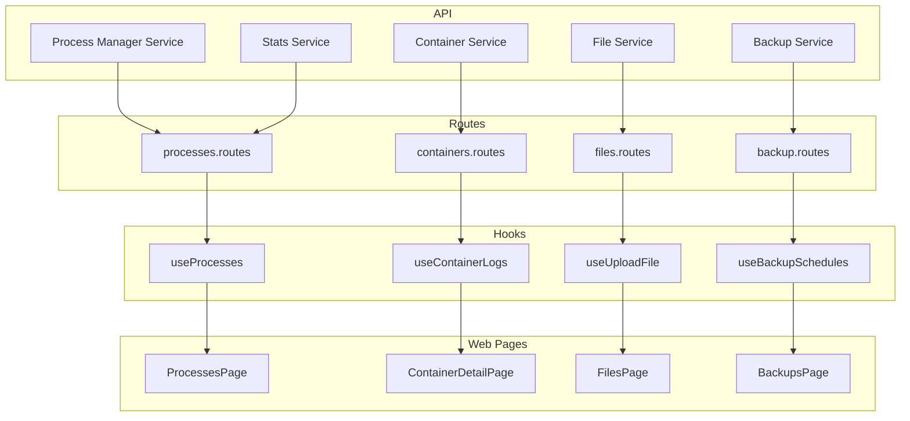

# NovaPanel Implementation Plan

## Executive Summary

This plan outlines the implementation strategy for NovaPanel, a server management panel built with Fastify (API) and React (Web). The project follows a monorepo structure using pnpm workspaces with Turbo.

### Architecture Overview

```
┌─────────────────────────────────────────────────────────────┐
│                        NovaPanel                            │
├─────────────────────────────────────────────────────────────┤
│  apps/web (React + TanStack Router + Tailwind CSS)          │
│  apps/api (Fastify + Drizzle ORM + Zod)                     │
│  packages/schemas (Shared Zod schemas)                      │
└─────────────────────────────────────────────────────────────┘
```

### Key Backend Services

- **Process Manager**: [`apps/api/src/services/process-manager/`](apps/api/src/services/process-manager/) - PM2/Systemd abstraction
- **Stats Service**: [`apps/api/src/modules/stats/`](apps/api/src/modules/stats/) - System metrics via `systeminformation`
- **Container Service**: [`apps/api/src/modules/containers/`](apps/api/src/modules/containers/) - Docker management
- **File Service**: [`apps/api/src/modules/files/`](apps/api/src/modules/files/) - File operations via `sudo-fs`
- **Backup Service**: [`apps/api/src/modules/backup/`](apps/api/src/modules/backup/) - Backup scheduling

---

## Phase 1: Critical Missing UI (HIGH Priority)

### 1.1 Process Manager UI

**Priority**: 🔴 CRITICAL  
**Gap**: Backend has PM2/Systemd managers but NO UI exists

#### Current State

- Backend service exists at [`apps/api/src/services/process-manager/`](apps/api/src/services/process-manager/)
- Interface: [`types.ts`](apps/api/src/services/process-manager/types.ts) defines `start()`, `stop()`, `restart()`, `getStatus()`, `logs()`, `delete()`
- Stats endpoint at `GET /stats/processes` exists but only returns basic process list

#### Implementation

**API Routes** - Create [`apps/api/src/modules/processes/`](apps/api/src/modules/processes/)

| File | Purpose |
|------|---------|
| [`processes.routes.ts`](apps/api/src/modules/processes/processes.routes.ts) | REST endpoints |
| [`processes.service.ts`](apps/api/src/modules/processes/processes.service.ts) | Business logic |
| [`processes.schema.ts`](apps/api/src/modules/processes/processes.schema.ts) | Zod validation |

**New Endpoints**:
```typescript
GET  /api/v1/processes              // List all managed processes
GET  /api/v1/processes/:name         // Get process status
POST /api/v1/processes/:name/start   // Start process
POST /api/v1/processes/:name/stop    // Stop process
POST /api/v1/processes/:name/restart // Restart process
DELETE /api/v1/processes/:name       // Delete process
GET  /api/v1/processes/:name/logs   // Get process logs
POST /api/v1/processes               // Create new process
```

**Web Components** - Create [`apps/web/src/pages/processes/`](apps/web/src/pages/processes/)

| File | Purpose |
|------|---------|
| [`ProcessesPage.tsx`](apps/web/src/pages/processes/ProcessesPage.tsx) | Main page with process list |
| [`ProcessDetailModal.tsx`](apps/web/src/pages/processes/ProcessDetailModal.tsx) | Process details + logs viewer |

**Hook** - Create [`apps/web/src/api/hooks/processes.ts`](apps/web/src/api/hooks/processes.ts)

**Route** - Add to [`apps/web/src/router.tsx`](apps/web/src/router.tsx:274)
```typescript
const processesRoute = createRoute({
  getParentRoute: () => appRoute,
  path: '/processes',
  component: ProcessesPage,
});
```

**Sidebar** - Update [`apps/web/src/components/layout/Sidebar.tsx`](apps/web/src/components/layout/Sidebar.tsx)
```typescript
// Add to Server section:
{ label: 'Processes', icon: 'icon-list' as const, path: '/processes' },
```

#### Migration Strategy

1. Register new routes in [`apps/api/src/routes.ts`](apps/api/src/routes.ts) under new `/processes` prefix
2. Add `useProcesses` hook following existing patterns in [`apps/web/src/api/hooks/`](apps/web/src/api/hooks/)
3. Create page component with real-time status polling (5s interval)
4. Use existing `Card` and `DataTable` UI components

---

### 1.2 File Manager Enhancements

**Priority**: 🔴 CRITICAL  
**Current**: Only browse, navigate, create dir, rename, delete  
**Missing**: Upload, edit, permissions, symlinks

#### Current State

Backend already has endpoints (see [`files.routes.ts`](apps/api/src/modules/files/files.routes.ts)):
- `PUT /files/permissions` - chmod already exists (line 140)
- `GET /files/content` / `PUT /files/content` - file editing already exists (lines 164-177)
- `POST /files/upload` - upload already exists (line 84)

**UI Gaps**: File upload button, code editor, permission editor modal, symlink creation

#### Implementation

**Files to Modify**:

| File | Change |
|------|--------|
| [`apps/web/src/pages/files/FilesPage.tsx`](apps/web/src/pages/files/FilesPage.tsx) | Add upload button, edit action, permission action |
| [`apps/web/src/api/hooks/files.ts`](apps/web/src/api/hooks/files.ts) | Add `useUploadFile`, `useFileContent`, `useSaveFileContent`, `useChmod` |

**New Components** to create in [`apps/web/src/pages/files/`](apps/web/src/pages/files/):

| File | Purpose |
|------|---------|
| [`FileEditorModal.tsx`](apps/web/src/pages/files/FileEditorModal.tsx) | Monaco/CodeMirror editor for file editing |
| [`PermissionsModal.tsx`](apps/web/src/pages/files/PermissionsModal.tsx) | chmod editor with octal display |
| [`UploadZone.tsx`](apps/web/src/pages/files/UploadZone.tsx) | Drag-and-drop file upload |
| [`SymlinkModal.tsx`](apps/web/src/pages/files/SymlinkModal.tsx) | Create symlink dialog |

**New Endpoints** (if needed):
```typescript
POST /files/symlink   // Create symbolic link (backend may need implementation)
```

#### Migration Strategy

1. Add new action buttons to table row in `FilesPage.tsx`
2. Import and use existing Modal component for editors
3. Follow existing mutation patterns for save operations

---

### 1.3 Container Management Enhancements

**Priority**: 🔴 CRITICAL  
**Current**: Only start/stop/restart/delete  
**Missing**: Logs, exec, ports, resources

#### Current State

- Backend endpoints exist: [`containers.routes.ts`](apps/api/src/modules/containers/containers.routes.ts)
- `GET /containers/:id/logs` exists (line 89)
- Container details stored in DB with `containerId` for Docker operations

#### Implementation

**Files to Modify**:

| File | Change |
|------|--------|
| [`apps/web/src/pages/containers/ContainerDetailPage.tsx`](apps/web/src/pages/containers/ContainerDetailPage.tsx) | Add logs tab, port mappings, resource usage |
| [`apps/web/src/pages/containers/ContainersPage.tsx`](apps/web/src/pages/containers/ContainersPage.tsx) | Add exec button, resource columns |
| [`apps/web/src/api/hooks/containers.ts`](apps/web/src/api/hooks/containers.ts) | Add `useContainerLogs`, `useContainerStats` |

**New Components** in [`apps/web/src/pages/containers/`](apps/web/src/pages/containers/):

| File | Purpose |
|------|---------|
| [`ContainerLogsTab.tsx`](apps/web/src/pages/containers/ContainerLogsTab.tsx) | Real-time log streaming |
| [`ContainerPortsTab.tsx`](apps/web/src/pages/containers/ContainerPortsTab.tsx) | Port mappings display |
| [`ContainerResourcesTab.tsx`](apps/web/src/pages/containers/ContainerResourcesTab.tsx) | CPU/memory usage graphs |
| [`ContainerExecModal.tsx`](apps/web/src/pages/containers/ContainerExecModal.tsx) | Exec into container |

**New Endpoints** (if needed):
```typescript
POST /containers/:id/exec    // Execute command in container
GET  /containers/:id/stats   // Resource usage stats
```

#### Migration Strategy

1. Add tabs to `ContainerDetailPage` following SiteDetailPage pattern
2. Use existing log query with refetch interval for real-time updates
3. Add stat endpoints that call `docker stats` command

---

### 1.4 Scheduled Backup Configuration

**Priority**: 🔴 CRITICAL  
**Current**: Only retention setting in ServerSettingsPage  
**Missing**: Full scheduling UI with destination selection

#### Current State

Backend has schedule endpoints in [`backup.routes.ts`](apps/api/src/modules/backup/backup.routes.ts):
- `GET /backups/schedules` (line 36)
- `POST /backups/schedules` (line 40)
- `POST /backups/schedules/:id/toggle` (line 54)
- `DELETE /backups/schedules/:id` (line 59)

**Gaps**: No UI for managing schedules, no S3/local destination selection

#### Implementation

**Files to Modify**:

| File | Change |
|------|--------|
| [`apps/web/src/pages/backups/BackupsPage.tsx`](apps/web/src/pages/backups/BackupsPage.tsx) | Add schedules section/tab |
| [`apps/web/src/api/hooks/backup.ts`](apps/web/src/api/hooks/backup.ts) | Add schedule hooks |

**New Components** in [`apps/web/src/pages/backups/`](apps/web/src/pages/backups/):

| File | Purpose |
|------|---------|
| [`BackupSchedulesTab.tsx`](apps/web/src/pages/backups/BackupSchedulesTab.tsx) | Schedule management list |
| [`CreateScheduleModal.tsx`](apps/web/src/pages/backups/CreateScheduleModal.tsx) | Create/edit schedule with cron builder |
| [`CronBuilder.tsx`](apps/web/src/pages/backups/CronBuilder.tsx) | Visual cron expression builder |

**New Hook** in [`apps/web/src/api/hooks/backup.ts`](apps/web/src/api/hooks/backup.ts):
```typescript
export function useBackupSchedules() { ... }
export function useCreateBackupSchedule() { ... }
export function useToggleBackupSchedule() { ... }
export function useDeleteBackupSchedule() { ... }
```

#### Migration Strategy

1. Add schedules section to `BackupsPage` below existing backup list
2. Use same modal pattern as create backup
3. Add cron builder component for schedule frequency

---

## Phase 2: UI Improvements (MEDIUM Priority)

### 2.1 Navigation Refactor

**Priority**: 🟠 MEDIUM

#### Changes

**[`apps/web/src/components/layout/Sidebar.tsx`](apps/web/src/components/layout/Sidebar.tsx)**:

```typescript
const navigationGroups = [
  {
    label: 'Apps',
    items: [
      { label: 'Sites', icon: 'icon-host' as const, path: '/sites' },
      { label: 'Databases', icon: 'icon-database' as const, path: '/databases' },
      // PROPOSED: Elevate Email to top-level
      { label: 'Email', icon: 'icon-mail' as const, path: '/mail' },
      { label: 'Apps Installer', icon: 'icon-download' as const, path: '/installer' }, // Rename
    ],
  },
  {
    label: 'Server',
    items: [
      { label: 'Services', icon: 'icon-server' as const, path: '/services' },
      { label: 'Processes', icon: 'icon-list' as const, path: '/processes' }, // NEW
      { label: 'Firewall', icon: 'icon-shield' as const, path: '/firewall' },
      { label: 'Backups', icon: 'icon-backup' as const, path: '/backups' },
      { label: 'Terminal', icon: 'icon-terminal' as const, path: '/terminal' },
      { label: 'Files', icon: 'icon-folder' as const, path: '/files' },
    ],
  },
  {
    label: 'Containers',
    items: [
      { label: 'Containers', icon: 'icon-box' as const, path: '/containers' },
      { label: 'Registries', icon: 'icon-cloud' as const, path: '/registries' },
    ],
  },
  // Move Domains section content elsewhere or rename
  {
    label: 'DNS & SSL',
    items: [
      { label: 'Domains', icon: 'icon-world' as const, path: '/domains' },
      { label: 'DNS', icon: 'icon-dns' as const, path: '/dns' },
      { label: 'SSL', icon: 'icon-lock' as const, path: '/ssl' },
      { label: 'FTP', icon: 'icon-upload' as const, path: '/ftp' },
    ],
  },
  {
    label: 'System',
    items: [
      { label: 'Monitoring', icon: 'icon-chart' as const, path: '/monitoring' },
      { label: 'Logs', icon: 'icon-file-text' as const, path: '/logs' },
      { label: 'Cron Jobs', icon: 'icon-clock' as const, path: '/cron' },
      { label: 'Jobs', icon: 'icon-list' as const, path: '/jobs' },
      { label: 'Audit', icon: 'icon-clipboard' as const, path: '/audit' },
    ],
  },
  {
    label: 'Settings',
    items: [
      { label: 'Server Settings', icon: 'icon-settings' as const, path: '/settings' },
      { label: 'Security', icon: 'icon-shield-check' as const, path: '/security' },
      { label: 'Notifications', icon: 'icon-bell' as const, path: '/notifications' },
      { label: 'Webhooks', icon: 'icon-webhook' as const, path: '/webhooks' },
      { label: 'API Tokens', icon: 'icon-key' as const, path: '/settings/api-tokens' },
      { label: 'Plugins', icon: 'icon-puzzle' as const, path: '/plugins' },
      { label: 'Billing', icon: 'icon-credit-card' as const, path: '/billing' },
      { label: 'Organizations', icon: 'icon-building' as const, path: '/organizations' },
      { label: 'Profile', icon: 'icon-user' as const, path: '/settings/profile' },
    ],
  },
];
```

---

### 2.2 Site Detail Page Simplification

**Priority**: 🟠 MEDIUM  
**Current**: 9 tabs (Overview, Deployments, Database, SSL, DNS, PHP, Webserver, Logs, Cron)

#### Proposed Grouping

```
┌─────────────────────────────────────────────────────┐
│ Overview | Deploy | Config | Logs                  │
└─────────────────────────────────────────────────────┘

Overview: Quick stats + essential info
Deploy: Deployment history + build controls
Config (collapsible section):
  ├ Database
  ├ SSL  
  ├ DNS
  ├ PHP
  └ Webserver
Logs: Combined access/error logs
Cron: Cron job management
```

#### Implementation

**[`apps/web/src/pages/sites/SiteDetailPage.tsx`](apps/web/src/pages/sites/SiteDetailPage.tsx)**:

```typescript
const tabs = [
  { id: 'overview', label: 'Overview' },
  { id: 'deploy', label: 'Deploy' },
  { id: 'config', label: 'Config' },  // Collapsible sub-sections
  { id: 'logs', label: 'Logs' },
  { id: 'cron', label: 'Cron' },
];
```

Create `ConfigSection` component with expandable sub-sections for Database, SSL, DNS, PHP, Webserver.

---

### 2.3 Cron Expression Builder UI

**Priority**: 🟠 MEDIUM  
**Current**: Raw cron input only  
**Missing**: Visual builder for common patterns

#### Implementation

**New Component** [`apps/web/src/components/ui/CronBuilder.tsx`](apps/web/src/components/ui/CronBuilder.tsx)

```typescript
interface CronPreset {
  label: string;
  expression: string;
  description: string;
}

const PRESETS: CronPreset[] = [
  { label: 'Every minute', expression: '* * * * *', description: 'Runs every minute' },
  { label: 'Every 5 minutes', expression: '*/5 * * * *', description: 'Runs every 5 minutes' },
  { label: 'Every hour', expression: '0 * * * *', description: 'Runs at the start of every hour' },
  { label: 'Daily at midnight', expression: '0 0 * * *', description: 'Runs daily at midnight' },
  { label: 'Weekly on Sunday', expression: '0 0 * * 0', description: 'Runs weekly on Sunday' },
  { label: 'Monthly', expression: '0 0 1 * *', description: 'Runs on the 1st of every month' },
];

// Manual builder with dropdowns for: minute, hour, day, month, weekday
```

**Integration**: Use in `CronPage.tsx` and `BackupSchedulesTab.tsx`

---

### 2.4 Database User Management UI

**Priority**: 🟠 MEDIUM  
**Current**: Mixed with database creation  
**Missing**: Separate user management

#### Implementation

**New Page** [`apps/web/src/pages/databases/DatabaseUsersPage.tsx`](apps/web/src/pages/databases/DatabaseUsersPage.tsx)

**Route** in [`router.tsx`](apps/web/src/router.tsx):
```typescript
const databaseUsersRoute = createRoute({
  getParentRoute: () => appRoute,
  path: '/databases/users',
  component: DatabaseUsersPage,
});
```

**Components**:

| File | Purpose |
|------|---------|
| [`DatabaseUsersPage.tsx`](apps/web/src/pages/databases/DatabaseUsersPage.tsx) | User list + create |
| [`CreateUserModal.tsx`](apps/web/src/pages/databases/CreateUserModal.tsx) | Create/edit user |

**New Endpoints**:
```typescript
GET  /databases/:id/users
POST /databases/:id/users
PUT  /databases/:id/users/:userId
DELETE /databases/:id/users/:userId
```

---

## Phase 3: Polish (LOW Priority)

### 3.1 Dark/Light Mode Toggle

**Priority**: 🟢 LOW

#### Implementation

1. Add theme context in [`apps/web/src/context/ThemeContext.tsx`](apps/web/src/context/ThemeContext.tsx)
2. Update CSS variables in [`apps/web/src/styles/variables.css`](apps/web/src/styles/variables.css)
3. Add toggle button to Topbar

**Files to Create**:
- [`apps/web/src/context/ThemeContext.tsx`](apps/web/src/context/ThemeContext.tsx)
- [`apps/web/src/styles/themes.css`](apps/web/src/styles/themes.css)

---

### 3.2 Keyboard Shortcuts / Command Palette

**Priority**: 🟢 LOW

#### Implementation

1. Create command palette hook in [`apps/web/src/hooks/useCommands.ts`](apps/web/src/hooks/useCommands.ts)
2. Create component [`apps/web/src/components/CommandPalette.tsx`](apps/web/src/components/CommandPalette.tsx)
3. Register shortcuts for common actions

**Key Bindings**:
- `Cmd+K`: Open command palette
- `G D`: Go to Dashboard
- `G S`: Go to Sites
- `G F`: Go to Files
- `Esc`: Close modals

---

### 3.3 Batch Operations (Multi-select)

**Priority**: 🟢 LOW

#### Implementation

1. Add selection state to `DataTable` component
2. Add batch action toolbar
3. Implement in FilesPage, ContainersPage first

**Files to Modify**:
- [`apps/web/src/components/ui/DataTable.tsx`](apps/web/src/components/ui/DataTable.tsx) - Add `selectable` prop
- [`apps/web/src/pages/files/FilesPage.tsx`](apps/web/src/pages/files/FilesPage.tsx) - Multi-select for delete/copy/move
- [`apps/web/src/pages/containers/ContainersPage.tsx`](apps/web/src/pages/containers/ContainersPage.tsx) - Batch start/stop

---

### 3.4 Dashboard Widgets Customization

**Priority**: 🟢 LOW

#### Implementation

1. Create widget registry in [`apps/web/src/components/dashboard/widgets/`](apps/web/src/components/dashboard/widgets/)
2. Add drag-and-drop grid layout

**Files to Create**:
- [`apps/web/src/components/dashboard/WidgetGrid.tsx`](apps/web/src/components/dashboard/WidgetGrid.tsx)
- [`apps/web/src/components/dashboard/widgets/CpuWidget.tsx`](apps/web/src/components/dashboard/widgets/CpuWidget.tsx)
- [`apps/web/src/components/dashboard/widgets/MemoryWidget.tsx`](apps/web/src/components/dashboard/widgets/MemoryWidget.tsx)
- [`apps/web/src/components/dashboard/widgets/UptimeWidget.tsx`](apps/web/src/components/dashboard/widgets/UptimeWidget.tsx)
- [`apps/web/src/components/dashboard/widgets/DomainsWidget.tsx`](apps/web/src/components/dashboard/widgets/DomainsWidget.tsx)

---

## File Manifest

### New Files to Create

```
Phase 1:
├── apps/api/src/modules/processes/
│   ├── processes.routes.ts
│   ├── processes.service.ts
│   └── processes.schema.ts
├── apps/web/src/pages/processes/
│   ├── ProcessesPage.tsx
│   └── ProcessDetailModal.tsx
├── apps/web/src/api/hooks/processes.ts
├── apps/web/src/pages/files/
│   ├── FileEditorModal.tsx
│   ├── PermissionsModal.tsx
│   ├── UploadZone.tsx
│   └── SymlinkModal.tsx
├── apps/web/src/pages/containers/
│   ├── ContainerLogsTab.tsx
│   ├── ContainerPortsTab.tsx
│   ├── ContainerResourcesTab.tsx
│   └── ContainerExecModal.tsx
├── apps/web/src/pages/backups/
│   ├── BackupSchedulesTab.tsx
│   ├── CreateScheduleModal.tsx
│   └── CronBuilder.tsx

Phase 2:
├── apps/web/src/components/ui/CronBuilder.tsx
├── apps/web/src/pages/databases/DatabaseUsersPage.tsx
└── apps/web/src/pages/databases/CreateUserModal.tsx

Phase 3:
├── apps/web/src/context/ThemeContext.tsx
├── apps/web/src/styles/themes.css
├── apps/web/src/hooks/useCommands.ts
├── apps/web/src/components/CommandPalette.tsx
└── apps/web/src/components/dashboard/
    ├── WidgetGrid.tsx
    └── widgets/
        ├── CpuWidget.tsx
        ├── MemoryWidget.tsx
        ├── UptimeWidget.tsx
        └── DomainsWidget.tsx
```

### Files to Modify

```
Phase 1:
├── apps/web/src/router.tsx (add processesRoute, containersRoute)
├── apps/web/src/components/layout/Sidebar.tsx (add Processes nav item)
├── apps/api/src/routes.ts (register processes routes)
├── apps/web/src/pages/files/FilesPage.tsx (upload, edit, permissions)
├── apps/web/src/api/hooks/files.ts (add missing hooks)
├── apps/web/src/pages/containers/ContainerDetailPage.tsx (add tabs)
├── apps/web/src/pages/backups/BackupsPage.tsx (add schedules section)

Phase 2:
├── apps/web/src/components/layout/Sidebar.tsx (nav refactor)
├── apps/web/src/pages/sites/SiteDetailPage.tsx (simplify tabs)
├── apps/web/src/pages/cron/CronPage.tsx (add cron builder)
└── apps/web/src/router.tsx (add databaseUsersRoute)

Phase 3:
├── apps/web/src/components/ui/DataTable.tsx (selectable prop)
├── apps/web/src/pages/dashboard/DashboardPage.tsx (widget customization)
└── apps/web/src/components/layout/Topbar.tsx (theme toggle)
```

---

## Testing Approach

### Unit Tests

1. **API Services**: Test business logic in isolation
   - Location: `*.service.test.ts` files
   - Framework: Vitest

2. **Components**: Test UI components with render + interaction
   - Location: `*.test.tsx` files
   - Framework: React Testing Library

### Integration Tests

1. **Playwright E2E**: Test critical user flows
   - Location: [`apps/web/tests/`](apps/web/tests/)
   - Examples:
     - `site-detail.spec.ts` - Site creation + deployment
     - `containers.spec.ts` - Container CRUD

### Test Files to Create

```
Phase 1:
├── apps/api/src/modules/processes/processes.service.test.ts
├── apps/web/src/pages/processes/ProcessesPage.test.tsx
├── apps/web/src/pages/backups/BackupSchedulesTab.test.tsx

Phase 2:
├── apps/web/src/components/ui/CronBuilder.test.tsx

Phase 3:
├── apps/web/src/components/dashboard/WidgetGrid.test.tsx
```

---

## Migration Strategy Summary

### General Principles

1. **Backward Compatibility**: Never remove existing endpoints until new ones are stable
2. **Incremental Updates**: Each feature is self-contained
3. **Feature Flags**: Consider adding flags for large features to enable/disable
4. **Database Migrations**: Use Drizzle migrations for schema changes

### Phase 1 Migration Order

```
1. Process Manager UI
   a. Create API routes first
   b. Create hooks
   c. Create page components
   d. Add to router and sidebar

2. File Manager Enhancements
   a. Backend already exists - just wire up UI
   b. Add upload zone to FilesPage
   c. Add editor modal

3. Container Enhancements
   a. Add new tabs to detail page
   b. Add new endpoints for stats

4. Backup Scheduling UI
   a. Add schedules section to BackupsPage
   b. Create schedule modal with cron builder
```

---

## Dependency Diagram



---

## Effort Breakdown

### Phase 1 (Critical)
| Item | Components | API Routes | Testing | Total |
|------|------------|------------|---------|-------|
| Process Manager UI | 2 | 3 | 2 | 7 |
| File Manager Enhancements | 4 | 0 | 1 | 5 |
| Container Enhancements | 4 | 2 | 1 | 7 |
| Backup Scheduling UI | 3 | 0 | 2 | 5 |
| **Phase 1 Total** | **13** | **5** | **6** | **24** |

### Phase 2 (Medium)
| Item | Components | API Routes | Testing | Total |
|------|------------|------------|---------|-------|
| Navigation Refactor | 1 | 0 | 0 | 1 |
| Site Detail Simplification | 1 | 0 | 1 | 2 |
| Cron Builder | 1 | 0 | 1 | 2 |
| DB User Management | 2 | 4 | 1 | 7 |
| **Phase 2 Total** | **5** | **4** | **3** | **12** |

### Phase 3 (Low)
| Item | Components | API Routes | Testing | Total |
|------|------------|------------|---------|-------|
| Dark/Light Mode | 2 | 0 | 1 | 3 |
| Command Palette | 2 | 0 | 1 | 3 |
| Batch Operations | 1 | 0 | 1 | 2 |
| Dashboard Widgets | 5 | 0 | 1 | 6 |
| **Phase 3 Total** | **10** | **0** | **4** | **14** |

---

## Next Steps

1. **Review**: User reviews and approves this plan
2. **Phase 1 Implementation**: Begin with Process Manager UI as it's the most critical gap
3. **Iterate**: Each phase can be implemented independently

---

*Document generated: 2026-05-25*
*Author: Architect Mode*