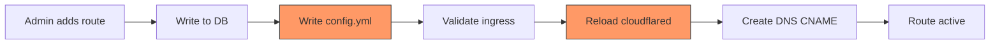
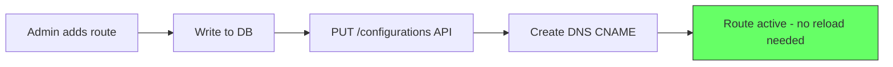

# Cloudflare Tunnel: Migration to Remote Config (API-Based) Approach

## Executive Summary

The current implementation uses the **local config.yml approach** — managing a YAML file on disk and reloading the cloudflared service on every route change. The official Cloudflare docs recommend the **remote config (API-based) approach** where configuration is stored on Cloudflare's side and updated via API calls, eliminating the need for local config files and service reloads.

---

## Architecture Comparison

### Current: Local Config Approach



**Pain points:**
- Service reload/restart causes ~2-5s tunnel downtime per route change
- If admin accesses panel via tunnel, they get disconnected on every route change
- Config file corruption can crash cloudflared
- Credentials file management is complex and error-prone
- CLI output parsing for tunnel ID is fragile

### Target: Remote Config Approach



**Benefits:**
- Zero-downtime route changes — cloudflared picks up remote config automatically
- No config.yml file management
- No service reload/restart on route changes
- No credentials file management (tunnel token used instead)
- API-based health checking instead of CLI parsing
- More reliable and simpler codebase

---

## Current vs Target: Method-by-Method

| Method | Current Implementation | Target Implementation |
|--------|----------------------|----------------------|
| `setup()` | `cloudflared tunnel create` CLI → parse stdout → read credentials JSON → write config.yml → install service with `--config` | `POST /accounts/{id}/cfd_tunnel` API → store tunnel token → install service with tunnel token |
| `addRoute()` | DB insert → write config.yml → reload daemon → create DNS | DB insert → `PUT /configurations` API → create DNS |
| `editRoute()` | DB update → write config.yml → reload daemon → update DNS | DB update → `PUT /configurations` API → update DNS |
| `deleteRoute()` | DB delete → write config.yml → reload daemon → delete DNS | DB delete → `PUT /configurations` API → delete DNS |
| `toggleRoute()` | DB toggle → write config.yml → reload daemon | DB toggle → `PUT /configurations` API |
| `getStatus()` | `systemctl is-active` + `cloudflared tunnel info` CLI | `systemctl is-active` + `GET /accounts/{id}/cfd_tunnel/{id}` API |
| `getTunnelInfo()` | `cloudflared tunnel info` CLI | `GET /accounts/{id}/cfd_tunnel/{id}` API |
| `deleteTunnel()` | `cloudflared tunnel delete` CLI | `DELETE /accounts/{id}/cfd_tunnel/{id}` API |
| `validateToken()` | Already fixed: dual cfut_/cfat_ support | No change needed |

---

## Database Schema Changes

### Current Schema

```sql
-- cloudflare_tunnels
id              TEXT PRIMARY KEY
name            TEXT NOT NULL
tunnel_id       TEXT          -- CF tunnel UUID
account_id      TEXT          -- CF account ID
api_token       TEXT          -- encrypted API token
credentials_json TEXT         -- encrypted credentials JSON
status          TEXT          -- active/inactive/error
created_at      INTEGER

-- tunnel_routes
id              TEXT PRIMARY KEY
tunnel_id       TEXT NOT NULL -- FK to cloudflare_tunnels.id
hostname        TEXT NOT NULL
service         TEXT NOT NULL
domain_id       TEXT          -- FK to domains.id
is_active       INTEGER       -- boolean
created_at      INTEGER
```

### New Schema

```sql
-- cloudflare_tunnels
id              TEXT PRIMARY KEY
name            TEXT NOT NULL
tunnel_id       TEXT          -- CF tunnel UUID
account_id      TEXT          -- CF account ID
zone_id         TEXT          -- NEW: CF zone ID for DNS operations
api_token       TEXT          -- encrypted API token
tunnel_token    TEXT          -- NEW: encrypted tunnel token from create API
credentials_json TEXT         -- kept for backward compat, not used in new flow
status          TEXT          -- active/inactive/error
created_at      INTEGER

-- tunnel_routes - add noTLSVerify support
id              TEXT PRIMARY KEY
tunnel_id       TEXT NOT NULL
hostname        TEXT NOT NULL
service         TEXT NOT NULL
no_tls_verify   INTEGER DEFAULT 0  -- NEW: for HTTPS local services
domain_id       TEXT
is_active       INTEGER
created_at      INTEGER
```

### Migration SQL

```sql
ALTER TABLE cloudflare_tunnels ADD COLUMN zone_id TEXT;
ALTER TABLE cloudflare_tunnels ADD COLUMN tunnel_token TEXT;
ALTER TABLE tunnel_routes ADD COLUMN no_tls_verify INTEGER DEFAULT 0;
```

---

## Detailed Implementation Plan

### Phase 1: Database Schema Update

**File:** `apps/api/src/db/schema/tunnels.ts`

- Add `zoneId` column to `cloudflareTunnels`
- Add `tunnelToken` column to `cloudflareTunnels` (encrypted)
- Add `noTlsVerify` column to `tunnelRoutes`
- Generate migration: `pnpm --filter api db:generate`
- Run migration: `pnpm --filter api db:migrate`

### Phase 2: Rewrite `setup()` — API-Based Tunnel Creation

**File:** `apps/api/src/modules/tunnel/tunnel.service.ts`

**Current flow:**
1. `cloudflared tunnel create {name}` (CLI)
2. Parse tunnel ID from stdout
3. Read credentials JSON from `/root/.cloudflared/{uuid}.json`
4. Write config.yml
5. Copy credentials to `/etc/cloudflared/{uuid}.json`
6. `cloudflared --config config.yml service install`
7. `systemctl enable cloudflared`

**New flow:**
1. `POST /accounts/{account_id}/cfd_tunnel` with `{ name, config_src: "cloudflare" }`
2. Response contains `id` (tunnel UUID) and `token` (tunnel token)
3. Store in DB: tunnelId, tunnelToken (encrypted), accountId
4. `cloudflared service install {TUNNEL_TOKEN}` — single command, no config file needed
5. `systemctl enable cloudflared`
6. `systemctl start cloudflared`

**Key API call:**
```
POST https://api.cloudflare.com/client/v4/accounts/{ACCOUNT_ID}/cfd_tunnel
Authorization: Bearer {API_TOKEN}
Content-Type: application/json

{
  "name": "my-tunnel",
  "config_src": "cloudflare"
}
```

**Response:**
```json
{
  "result": {
    "id": "abc123-def456-...",
    "name": "my-tunnel",
    "token": "eyJh...long-jwt-token..."
  },
  "success": true
}
```

### Phase 3: Rewrite Route Management — Remote Config API

**File:** `apps/api/src/modules/tunnel/tunnel.service.ts`

**Core change:** Replace `writeConfigFile()` + `reloadDaemon()` with a single `updateRemoteConfig()` method.

**New private method:**
```typescript
private async updateRemoteConfig(tunnel: any, routes: any[]) {
  const apiToken = decrypt(tunnel.apiToken);
  const accountId = tunnel.accountId;
  const tunnelId = tunnel.tunnelId;

  const activeRoutes = routes.filter(r => r.isActive);

  const ingress = [
    ...activeRoutes.map(r => {
      const rule: any = {
        hostname: r.hostname,
        service: r.service,
      };
      if (r.noTlsVerify) {
        rule.originRequest = { noTLSVerify: true };
      }
      return rule;
    }),
    { service: 'http_status:404' },  // mandatory catch-all
  ];

  const response = await fetch(
    `https://api.cloudflare.com/client/v4/accounts/${accountId}/cfd_tunnel/${tunnelId}/configurations`,
    {
      method: 'PUT',
      headers: {
        Authorization: `Bearer ${apiToken}`,
        'Content-Type': 'application/json',
      },
      body: JSON.stringify({ config: { ingress } }),
    }
  );

  const data = await response.json();
  if (!data.success) {
    throw new AppError(500, 'CONFIG_UPDATE_FAILED', 
      data.errors?.[0]?.message || 'Failed to update tunnel configuration');
  }
}
```

**Methods to update:**
- `addRoute()` — replace `writeConfigFile()` + `reloadDaemon()` with `updateRemoteConfig()`
- `editRoute()` — same replacement
- `deleteRoute()` — same replacement
- `toggleRoute()` — same replacement

**Methods to remove:**
- `writeConfigFile()` — no longer needed
- `reloadDaemon()` — no longer needed
- `parseTunnelId()` — no longer needed (API returns JSON)

### Phase 4: Rewrite Status/Info — API Health Endpoints

**File:** `apps/api/src/modules/tunnel/tunnel.service.ts`

**`getStatus()` — new flow:**
1. `systemctl is-active cloudflared` — check process running
2. For each tunnel in DB: `GET /accounts/{id}/cfd_tunnel/{id}` — check connections
3. Return status based on process + connections

**Key API call:**
```
GET https://api.cloudflare.com/client/v4/accounts/{ACCOUNT_ID}/cfd_tunnel/{TUNNEL_ID}
Authorization: Bearer {API_TOKEN}
```

**Response includes:**
```json
{
  "result": {
    "id": "...",
    "status": "healthy",
    "connections": [
      { "id": "...", "colo": "DFW", "ip": "..." }
    ]
  }
}
```

**`getTunnelInfo()` — new flow:**
1. `GET /accounts/{id}/cfd_tunnel/{id}` — get tunnel details from API
2. Return combined DB + API data

### Phase 5: Rewrite Delete — API-Based

**File:** `apps/api/src/modules/tunnel/tunnel.service.ts`

**Current flow:**
1. Stop cloudflared service
2. `cloudflared tunnel delete {id} --force` (CLI)
3. Delete credentials files
4. Delete from DB

**New flow:**
1. Stop cloudflared service
2. `DELETE /accounts/{id}/cfd_tunnel/{id}` (API)
3. Uninstall service: `cloudflared service uninstall`
4. Delete from DB

**Key API call:**
```
DELETE https://api.cloudflare.com/client/v4/accounts/{ACCOUNT_ID}/cfd_tunnel/{TUNNEL_ID}
Authorization: Bearer {API_TOKEN}
```

### Phase 6: Update Frontend

**Files:**
- `apps/web/src/api/hooks/tunnel.ts`
- `apps/web/src/pages/tunnels/TunnelsPage.tsx`

**Changes needed:**

1. **Setup wizard — Step 1 (Token):**
   - Show account name from `validateToken()` response
   - For `cfat_` tokens: show account name from accounts list
   - For `cfut_` tokens: show status from verify endpoint

2. **Setup wizard — Step 2 (Zone):**
   - Already works — fetchZones returns zone list
   - Store selected `zoneId` in form state
   - Pass `zoneId` to setup endpoint

3. **Setup wizard — Step 3 (Name):**
   - Pass `accountId` from zone selection (not zoneId)
   - Pass `zoneId` for DNS operations

4. **Add Route form:**
   - Add `noTLSVerify` checkbox when service starts with `https://`
   - Default to `true` for `https://localhost` services

5. **Route table:**
   - Show TLS verify status per route
   - Show connection count from tunnel health API

6. **Tunnel status:**
   - Show connector count from API health response
   - Show "healthy" / "inactive" status from API

### Phase 7: Add noTLSVerify Support

**Why:** When the panel runs with a self-signed cert, the tunnel route needs `noTLSVerify: true` to tell cloudflared to skip certificate verification on the local connection.

**Implementation:**
- Add `noTlsVerify` boolean to tunnel routes schema
- In the remote config `ingress` array, add `originRequest: { noTLSVerify: true }` when enabled
- Frontend: auto-detect `https://localhost` services and suggest enabling it

### Phase 8: End-to-End Testing

**Test scenarios:**
1. Create tunnel with `cfat_` account token → verify tunnel appears in Cloudflare dashboard
2. Add route → verify DNS CNAME created → verify site accessible
3. Add multiple routes → verify all accessible
4. Edit route hostname → verify old DNS deleted, new DNS created
5. Toggle route off → verify site returns 404
6. Delete route → verify DNS record removed
7. Delete tunnel → verify tunnel removed from Cloudflare
8. Test with `cfut_` user token → verify same flow works
9. Test panel route with `noTLSVerify` → verify self-signed cert works

---

## API Endpoints Reference

### Tunnel CRUD
| Operation | Method | Endpoint |
|-----------|--------|----------|
| Create tunnel | POST | `/accounts/{account_id}/cfd_tunnel` |
| Get tunnel | GET | `/accounts/{account_id}/cfd_tunnel/{tunnel_id}` |
| List tunnels | GET | `/accounts/{account_id}/cfd_tunnel` |
| Delete tunnel | DELETE | `/accounts/{account_id}/cfd_tunnel/{tunnel_id}` |
| Update config | PUT | `/accounts/{account_id}/cfd_tunnel/{tunnel_id}/configurations` |

### Token Validation
| Token Type | Method | Endpoint |
|------------|--------|----------|
| User (cfut_) | GET | `/user/tokens/verify` |
| Account (cfat_) | GET | `/accounts` |

### DNS Records
| Operation | Method | Endpoint |
|-----------|--------|----------|
| List records | GET | `/zones/{zone_id}/dns_records` |
| Create CNAME | POST | `/zones/{zone_id}/dns_records` |
| Delete record | DELETE | `/zones/{zone_id}/dns_records/{record_id}` |

### Zones
| Operation | Method | Endpoint |
|-----------|--------|----------|
| List zones | GET | `/zones` |
| List zones by account | GET | `/zones?account.id={account_id}` |

---

## Files to Modify

| File | Changes |
|------|---------|
| `apps/api/src/db/schema/tunnels.ts` | Add `zoneId`, `tunnelToken`, `noTlsVerify` columns |
| `apps/api/src/modules/tunnel/tunnel.service.ts` | Major rewrite — API-based tunnel management |
| `apps/api/src/modules/tunnel/tunnel.routes.ts` | Update setup route to accept `zoneId` |
| `apps/api/src/modules/tunnel/tunnel.schema.ts` | Add `zoneId` to setup schema, `noTlsVerify` to route schema |
| `apps/web/src/api/hooks/tunnel.ts` | Update types and API hooks |
| `apps/web/src/pages/tunnels/TunnelsPage.tsx` | Update setup wizard, route forms, status display |

## Files to Remove (Dead Code After Migration)

- `writeConfigFile()` method — no longer needed
- `reloadDaemon()` method — no longer needed  
- `parseTunnelId()` method — no longer needed
- YAML import — no longer needed for config management
- `sudoFs` usage for config files — no longer needed
- Credentials file management code

---

## Backward Compatibility

For existing installations that already have a tunnel created with the local config approach:
1. Detect if `tunnelToken` is null in DB → old approach
2. Fall back to CLI-based operations for that tunnel
3. Admin can "migrate" by deleting and recreating the tunnel
4. Or add a migration endpoint that converts existing tunnel to remote config

---

## Risk Mitigation

1. **Tunnel token storage** — Encrypt with same AES-256 used for API token
2. **API rate limits** — Cloudflare API has generous limits; route changes are infrequent
3. **Service install with token** — `cloudflared service install` stores the token in the systemd unit file; ensure proper file permissions
4. **Config rollback** — If `PUT /configurations` fails, DB state is already updated; need to handle inconsistency
5. **Panel accessed via tunnel** — Route changes no longer cause disconnect since no reload needed
