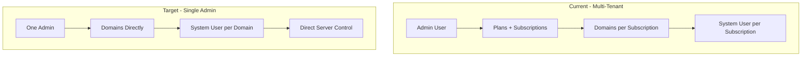
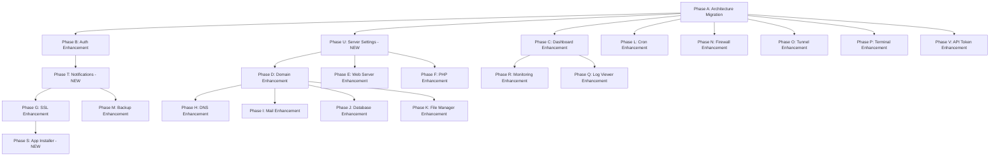

# ServerForge — Comprehensive Upgrade Plan

> **Goal:** Upgrade NovaPanel from its current multi-tenant architecture to the single-admin ServerForge specification defined in `plesk-features-and-flows.md`.
> **Date:** 2026-04-25

---

## Executive Summary

The current NovaPanel system has 18 phases of implementation covering auth, domains, web server, PHP, SSL, DNS, mail, databases, FTP, file manager, terminal, logs, cron, firewall, backups, and audit. However, there are **critical architectural differences** and **significant feature gaps** compared to the target specification.

### Key Findings

| Area | Current State | Target State | Gap Level |
|------|--------------|--------------|-----------|
| Architecture | Multi-tenant with plans/subscriptions | Single admin, no multi-tenancy | **CRITICAL** |
| Auth | Basic login + 2FA + sessions | Full brute-force protection, backup codes, remember-me, forgot password, profile management | **HIGH** |
| Dashboard | Static stat cards + service list | Real-time WebSocket, graphs, warnings panel, quick actions, activity feed | **HIGH** |
| Domains | CRUD with nginx/apache setup | Clone, bulk ops, access log stats, quick settings panel | **MEDIUM** |
| Web Server | Basic config save | Hotlink protection, IP restrictions, gzip, caching, rate limiting, custom errors, preview/test | **HIGH** |
| PHP | Version/handler selection | Full FPM pool settings, custom php.ini, security settings, phpinfo, pool status | **HIGH** |
| SSL | Let's Encrypt + custom upload | Wildcard DNS-01, self-signed, HSTS preload, OCSP, auto-renew job, chain validator, download | **MEDIUM** |
| DNS | Basic CRUD | Import/export, propagation checker, raw zone view, reset, external DNS mode | **MEDIUM** |
| Mail | Domain enable/disable, mailbox, aliases, DKIM | Catch-all, auto-responder, SpamAssassin, mail queue, webmail link, SPF/DMARC helpers | **HIGH** |
| Databases | Create/delete DB and users | Export/import, clone, repair/optimize, phpMyAdmin SSO, SQL editor, remote access | **HIGH** |
| FTP | Basic CRUD | Last login, connection info, FTPS, global settings | **LOW** |
| File Manager | Basic browse/upload/delete | Drag-drop, multi-upload, zip, code editor, previews, archive, permissions editor | **HIGH** |
| Cron | Basic CRUD + toggle | Visual builder, run now, history, next run, email on failure, presets | **MEDIUM** |
| Backup | Basic create/restore, local | Scheduled, remote S3/SFTP, encryption, integrity check, retention, progress WS | **HIGH** |
| Firewall | UFW rules + Fail2Ban jails | SSH settings, login activity, port scanner, unattended upgrades | **MEDIUM** |
| Cloudflare Tunnel | Basic setup + routes | Setup wizard, API validation, zone selection, auto-CNAME, live logs WS | **MEDIUM** |
| Terminal | Basic xterm.js | Multiple tabs, font size, download log, session timeout | **LOW** |
| Logs | Basic viewing | Real-time WS tail, search/filter, date range, download/clear, rotation settings | **MEDIUM** |
| Monitoring | Basic stats via systeminformation | Historical graphs, top processes, per-domain bandwidth, alert thresholds, versions | **HIGH** |
| App Installer | **NOT EXISTS** | WordPress, Joomla, etc. with WP-CLI integration | **NEW** |
| Notifications | **NOT EXISTS** | Bell icon, email delivery, per-type toggles, test email | **NEW** |
| API Tokens | Basic generate | Scoped permissions, usage log, expiry options | **MEDIUM** |
| Server Settings | **NOT EXISTS** | General, security, SMTP, DNS, notifications, updates, danger zone | **NEW** |

---

## Architecture Overview — Current vs Target

---

## Phase A — Architectural Migration: Multi-Tenant to Single-Admin

This is the foundational change that affects every module.

### A.1 Database Schema Migration

**Remove multi-tenant artifacts:**
- Remove `plans` table — not needed for single admin
- Remove `subscriptions` table — domains belong directly to admin
- Remove `parentId` from `users` — no reseller/customer hierarchy
- Remove `role` enum with multiple values — single admin role
- Update `domains` to remove `subscriptionId` foreign key
- Update `databases` to remove `subscriptionId` foreign key
- Update `cronJobs` to remove `subscriptionId` foreign key
- Update `backups` to remove `subscriptionId` foreign key
- Update `backupSchedules` to remove `subscriptionId` foreign key

**Add new schema fields:**
- `users` table: add `displayName`, `failedLoginAttempts`, `lockedUntil`, `passwordChangedAt`, `mustChangePassword`
- `sessions` table: add `rememberMe` flag
- `domains` table: add `systemUser`, `bandwidthUsedMb`, add `diskUsedMb`
- `sslCertificates` table: add `renewalFailCount`
- `cronJobs` table: add `emailOnFailure`, add `lastRunOutput`
- New `cronJobRuns` table for execution history
- New `notifications` table
- New `notificationSettings` table
- New `apiTokens` table — separate from users
- New `serverSettings` table or config system
- New `appInstallations` table
- New `statsHistory` table — already partially exists as `serverStats`

### A.2 Service Layer Refactor

- Every service currently takes `subscriptionId` — refactor to work with `domainId` or globally
- Remove subscription/plan limit checks from domain, database, FTP, mail services
- Simplify auth to single admin user — remove role-based access patterns
- Update `executor.ts` to run commands as domain-specific system users

### A.3 Frontend Refactor

- Remove any subscription/plan selection UI from domain creation
- Remove multi-user management UI if present
- Simplify navigation — no user switching or subscription context
- Add domain-centric navigation where each domain has its own detail page with tabs

---

## Phase B — Auth Module Enhancement

### B.1 Backend: Brute-Force Protection

Files to modify: [`auth.service.ts`](apps/api/src/modules/auth/auth.service.ts), [`users.ts`](apps/api/src/db/schema/users.ts)

- Add `failedLoginAttempts` counter on user record
- Add `lockedUntil` timestamp field
- On failed login: increment counter; if >= 5, set `lockedUntil` = now + 15 minutes
- On successful login: reset counter to 0
- Return lockout message with remaining time when locked

### B.2 Backend: Remember Me

Files to modify: [`auth.service.ts`](apps/api/src/modules/auth/auth.service.ts), [`auth.routes.ts`](apps/api/src/modules/auth/auth.routes.ts)

- Accept `rememberMe` boolean in login request
- If true: session expires in 30 days
- If false: session expires in 2 hours with idle timeout
- Store `rememberMe` flag in session record

### B.3 Backend: 2FA Backup Codes

Files to modify: [`auth.service.ts`](apps/api/src/modules/auth/auth.service.ts), new schema table `twoFactorBackupCodes`

- Generate 8 backup codes on 2FA setup — each 10-char alphanumeric
- Hash codes with argon2id and store in DB
- Add backup code verification path in login flow
- Mark codes as used after single use
- Add `Use backup code` option on 2FA screen

### B.4 Backend: Forgot Password

New files: `apps/api/src/modules/auth/password-reset.service.ts`

- Add `POST /auth/forgot-password` — accepts email, generates reset token, stores in DB with 1-hour expiry
- Add `POST /auth/reset-password` — accepts token + new password, validates token, updates password
- Email sending depends on SMTP settings from Phase G

### B.5 Backend: Profile Management

Files to modify: [`auth.routes.ts`](apps/api/src/modules/auth/auth.routes.ts)

- Add `PUT /auth/profile` — change display name, email
- Add `PUT /auth/password` — change password with current password verification
- Add `GET /auth/sessions` — list all active sessions with parsed user agent
- Add `DELETE /auth/sessions/:id` — revoke specific session
- Add `DELETE /auth/sessions` — revoke all other sessions

### B.6 Frontend: Login Flow Enhancement

Files to modify: [`LoginPage.tsx`](apps/web/src/pages/login/LoginPage.tsx), [`LoginForm.tsx`](apps/web/src/pages/login/LoginForm.tsx), [`TwoFactorForm.tsx`](apps/web/src/pages/login/TwoFactorForm.tsx)

- Add Remember Me checkbox
- Add brute-force lockout countdown display
- Add backup code entry on 2FA screen
- Add Forgot Password flow with email input and reset page
- Show remaining attempt count on wrong credentials

### B.7 Frontend: Profile Page

New file: `apps/web/src/pages/settings/ProfilePage.tsx`

- Display name, email, avatar initials
- Change password form
- 2FA setup/management with QR code display
- Active sessions list with revoke buttons
- Backup codes display on first 2FA setup

---

## Phase C — Dashboard Enhancement

### C.1 Backend: WebSocket Real-Time Stats

New file: `apps/api/src/modules/stats/stats.websocket.ts`

- Create WebSocket endpoint `/ws/stats`
- Background job polls system stats every 5 seconds
- Push CPU, RAM, network delta, service statuses to connected clients
- Use `systeminformation` library already in use

### C.2 Backend: Enhanced Dashboard Data

Files to modify: [`stats.service.ts`](apps/api/src/modules/stats/stats.service.ts), [`stats.routes.ts`](apps/api/src/modules/stats/stats.routes.ts)

- Add `getEntityCounts()` — count domains, mailboxes, databases, FTP accounts, active cron jobs
- Add `getExpiringSslCerts()` — SSL certs expiring in < 30 days
- Add `getRecentAuditLogs(limit)` — last 10 audit entries
- Add `controlService(name, action)` — start/stop/restart with allowlist validation
- Add `getNetworkStats()` with per-second delta calculation

### C.3 Frontend: Dashboard Redesign

Files to modify: [`DashboardPage.tsx`](apps/web/src/pages/dashboard/DashboardPage.tsx)

- Real-time stat tiles with sparkline mini-graphs using Recharts
- CPU + RAM combined graph with time range toggle: 1h / 6h / 24h
- Network I/O graph
- Services status grid with click-to-restart dropdown
- Warnings panel: expiring SSL, high disk, down services
- Summary cards row: total domains, mailboxes, databases, FTP, cron
- Recent activity feed from audit logs
- Quick action buttons: Add Domain, New Database, Issue SSL, Open Terminal
- System info card: OS, kernel, hostname, IPs

---

## Phase D — Domain Management Enhancement

### D.1 Backend: Enhanced Domain Creation

Files to modify: [`domains.service.ts`](apps/api/src/modules/domains/domains.service.ts)

- Remove subscription/plan dependency
- Add `createDns` checkbox option — auto-create BIND9 zone
- Add `createMail` checkbox option — auto-configure mail domain with DKIM
- Add document root customization during creation
- Add full rollback on any step failure
- Add domain rename functionality
- Add domain clone — copy config to new domain

### D.2 Backend: Bulk Operations

Files to modify: [`domains.routes.ts`](apps/api/src/modules/domains/domains.routes.ts)

- Add `POST /domains/bulk` endpoint for bulk suspend/activate/delete
- Accept array of domain IDs with action type

### D.3 Frontend: Domain Detail Page

New file: `apps/web/src/pages/domains/DomainDetailPage.tsx`

- Tabbed interface: Overview, Web Server, PHP, SSL, DNS, Mail, FTP, Files, Logs
- Overview tab: PHP version, web server, SSL status, disk usage, quick links
- Per-domain quick settings slide-over panel
- Domain list with sortable columns and search/filter
- Bulk select with action toolbar

---

## Phase E — Web Server Configuration Enhancement

### E.1 Backend: Full Config Builder

Files to modify: [`webserver.service.ts`](apps/api/src/modules/webserver/webserver.service.ts)

- Add hotlink protection config generation with `valid_referers` block
- Add IP access restriction — allow/deny rules from whitelist/blacklist
- Add gzip compression toggle per domain
- Add browser caching headers with expiry control
- Add custom error pages per HTTP code
- Add reverse proxy configuration with `proxy_pass`
- Add request rate limiting per domain
- Add max upload file size setting
- Add config preview endpoint — returns rendered config without saving
- Add config test endpoint — runs `nginx -t` without reloading

### E.2 Frontend: Web Server Config Page

Files to modify: [`WebserverPage.tsx`](apps/web/src/pages/webserver/WebserverPage.tsx)

- Organized sections: Server Mode, Performance, Security, Reverse Proxy, Custom Errors, Custom Directives
- Toggle switches for gzip, caching, hotlink protection
- IP restriction editor with CIDR support
- Custom directives textarea with syntax hints
- Preview Config button → modal with full rendered config
- Test Config button → validation result display

---

## Phase F — PHP Management Enhancement

### F.1 Backend: Full PHP-FPM Pool Management

Files to modify: [`php.service.ts`](apps/api/src/modules/php/php.service.ts)

- Add PHP-FPM pool config rendering with all pm settings: mode, max_children, start_servers, min/max_spare_servers
- Add PHP limits management: memory_limit, max_execution_time, upload_max_filesize, etc.
- Add custom php.ini values per domain — key-value pairs
- Add `open_basedir` restriction toggle
- Add disabled functions list per domain
- Add phpinfo endpoint — create temp file, internal request, capture output, delete temp
- Add PHP-FPM pool status endpoint — parse status page
- Add restart pool endpoint

### F.2 Frontend: PHP Settings Page

Files to modify: [`PhpPage.tsx`](apps/web/src/pages/php/PhpPage.tsx)

- Sections: Version and Handler, Process Manager, PHP Limits, Security, Custom php.ini
- PM mode selector with dynamic fields
- Disabled functions checklist
- Custom php.ini key-value editor with add/remove rows
- View PHP Info button → modal iframe
- Restart FPM Pool button

---

## Phase G — SSL Enhancement

### G.1 Backend: Auto-Renew Background Job

New file: `apps/api/src/modules/ssl/ssl.cron.ts`

- Daily job at 3:00 AM
- Query all LE certs where `autoRenew = true` and `expiresAt < now + 30 days`
- Run `certbot renew` for each
- Update DB on success, increment `renewalFailCount` on failure
- Send notification on success/failure

### G.2 Backend: Additional SSL Features

Files to modify: [`ssl.service.ts`](apps/api/src/modules/ssl/ssl.service.ts)

- Add wildcard certificate via DNS-01 challenge with Cloudflare API
- Add self-signed certificate generation
- Add HSTS with preload option
- Add OCSP stapling toggle in nginx config
- Add certificate chain validator
- Add download certificate files endpoint — cert.pem, key.pem, chain.pem
- Add mixed-content checker — scan domain for HTTP resources

### G.3 Frontend: SSL Page Enhancement

Files to modify: [`SslPage.tsx`](apps/web/src/pages/ssl/SslPage.tsx)

- SSL issuance modal with progress steps via WebSocket
- Certificate type selector: Let's Encrypt, Custom Upload, Self-Signed
- Domain selection with SAN checkboxes
- Certificate details view: issuer, validity, SANs, fingerprint
- HSTS and OCSP toggles
- Download certificate files buttons
- Manual renew button

---

## Phase H — DNS Enhancement

### H.1 Backend: Zone Import/Export and Tools

Files to modify: [`dns.service.ts`](apps/api/src/modules/dns/dns.service.ts)

- Add zone import from BIND zone file text — parse and create records
- Add zone export as downloadable BIND zone file
- Add reset zone to defaults — regenerate standard records
- Add raw zone file view endpoint
- Add DNS propagation checker — query external resolvers: 8.8.8.8, 1.1.1.1, 9.9.9.9
- Add external DNS mode — disable local BIND, manage via Cloudflare API

### H.2 Frontend: DNS Page Enhancement

Files to modify: [`DnsPage.tsx`](apps/web/src/pages/dns/DnsPage.tsx)

- Toolbar: Import Zone, Export Zone, Reset to Defaults, View Raw, Check Propagation
- Inline add record form at bottom of table
- Inline edit on existing rows
- SOA section expandable panel
- Propagation results table with checkmarks per resolver

---

## Phase I — Mail Management Enhancement

### I.1 Backend: Missing Mail Features

Files to modify: [`mail.service.ts`](apps/api/src/modules/mail/mail.service.ts)

- Add catch-all address configuration
- Add auto-responder per mailbox — Sieve rule generation
- Add SpamAssassin toggle per domain with score threshold
- Add mail queue viewer — parse `postqueue -p` output
- Add flush mail queue — `postqueue -f`
- Add delete message from queue — `postsuper -d`
- Add SPF record helper — one-click recommended SPF TXT record
- Add DMARC record helper — policy selector with report email
- Add webmail access link generation
- Add SMTP/IMAP/POP3 connection info endpoint

### I.2 Frontend: Mail Page Enhancement

Files to modify: [`MailPage.tsx`](apps/web/src/pages/mail/MailPage.tsx)

- Sub-tabs: Mailboxes, Aliases, Settings, Security, Logs
- Settings tab: catch-all, SpamAssassin, connection info display
- Security tab: DKIM status/generate/rotate, SPF apply/edit, DMARC policy
- Mail queue viewer with flush and delete buttons
- Auto-responder toggle with subject/message fields

---

## Phase J — Database Management Enhancement

### J.1 Backend: Missing Database Features

Files to modify: [`databases.service.ts`](apps/api/src/modules/databases/databases.service.ts)

- Add database export — `mysqldump` / `pg_dump` to `.sql.gz` with streaming
- Add database import from uploaded SQL file
- Add database clone — copy schema + data to new DB
- Add repair tables — `mysqlcheck` for MariaDB
- Add optimize tables — `mysqlcheck --optimize`
- Add phpMyAdmin/phpPgAdmin SSO URL generation
- Add inline SQL query executor — run SELECT queries with result pagination
- Add remote access toggle — grant user access from `%`
- Add database size calculation
- Add view tables list

### J.2 Frontend: Databases Page Enhancement

Files to modify: [`DatabasesPage.tsx`](apps/web/src/pages/databases/DatabasesPage.tsx)

- Per-database action menu: Manage Users, phpMyAdmin link, Export, Import, Clone, Repair, Optimize, Delete
- Export with download progress bar
- Import with file upload modal and progress
- Inline SQL query editor with results table
- Database size display
- Users management sub-view

---

## Phase K — File Manager Enhancement

### K.1 Backend: Missing File Operations

Files to modify: [`files.service.ts`](apps/api/src/modules/files/files.service.ts)

- Add download folder as zip — `tar` or archiver library
- Add move files — `fs.rename` with path validation
- Add copy files — `fs.cp` or `cp -r`
- Add extract archive — support .zip, .tar.gz, .tar.bz2
- Add create archive — compress selected files to .zip or .tar.gz
- Add permissions editor — `chmod` with octal mode, optional recursive
- Add directory size calculation — `du -sm`
- Add file search within directory
- Add hidden files toggle — include dotfiles in listing
- Add upload with multipart streaming and progress

### K.2 Frontend: File Manager Redesign

Files to modify: [`FilesPage.tsx`](apps/web/src/pages/files/FilesPage.tsx)

- Split layout: left directory tree + right file list
- Top toolbar: Upload, New Folder, New File, Download, Archive, Cut, Paste, Delete, Search
- Drag-and-drop upload with per-file progress bars
- Double-click: folders navigate, text files open code editor, images show preview
- Right-click context menu
- Code editor modal with syntax highlighting via CodeMirror
- Image/video/PDF preview modals
- Permissions modal with checkbox grid and octal input
- Breadcrumb path bar
- Sort by name/size/date

---

## Phase L — Cron Enhancement

### L.1 Backend: Missing Cron Features

Files to modify: [`cron.service.ts`](apps/api/src/modules/cron/cron.service.ts)

- Add run now — execute command immediately, capture stdout/stderr/exit code
- Add cron job run history — new `cronJobRuns` table
- Add next scheduled run time calculation using `cron-parser`
- Add email on failure toggle per job
- Add common schedule presets
- Add human-readable description of cron expression
- Add cron expression validation with next 5 run times preview

### L.2 Frontend: Cron Page Enhancement

Files to modify: [`CronPage.tsx`](apps/web/src/pages/cron/CronPage.tsx)

- Visual schedule builder with presets: Every minute, Hourly, Daily, Weekly, Monthly
- Custom 5-field input with real-time human-readable description
- Run Now button → modal with live output
- View History → last 20 run results
- Next run time display
- Email on failure toggle

---

## Phase M — Backup Enhancement

### M.1 Backend: Advanced Backup Features

Files to modify: [`backup.service.ts`](apps/api/src/modules/backup/backup.service.ts)

- Add scheduled backup execution — background job reads schedule config
- Add remote storage: SFTP upload, S3-compatible upload with multipart
- Add backup encryption — `openssl enc -aes-256-cbc -pbkdf2`
- Add integrity check — SHA-256 checksum generation and verification
- Add retention policy — auto-delete oldest backups beyond keepN
- Add partial restore — files only, DB only, mail only, DNS only
- Add backup progress via WebSocket events
- Add database dump step in backup flow
- Add mail config export step
- Add panel config export step

### M.2 Frontend: Backup Page Enhancement

Files to modify: [`BackupsPage.tsx`](apps/web/src/pages/backups/BackupsPage.tsx)

- Sub-tabs: Backups List, Schedule, Storage Settings
- Create Backup modal with scope selection: Full or Custom checkboxes
- Real-time progress modal via WebSocket
- Schedule tab: frequency, time, scope, retention
- Storage Settings tab: Local, SFTP, S3-compatible with Test Connection
- Partial restore options

---

## Phase N — Firewall and Security Enhancement

### N.1 Backend: Missing Security Features

Files to modify: [`firewall.service.ts`](apps/api/src/modules/firewall/firewall.service.ts)

- Add SSH settings management — read/write `/etc/ssh/sshd_config`
- Add SSH config test — `sshd -t` before applying
- Add login activity viewer — parse `/var/log/auth.log` for SSH logins
- Add panel login attempts log from audit data
- Add Fail2Ban jail configuration — maxRetry, findTime, banTime per jail
- Add manual ban/unban IP operations
- Add port scanner — scan own server for open ports
- Add UFW toggle individual rules without deleting
- Add unattended-upgrades toggle

### N.2 Frontend: Firewall Page Enhancement

Files to modify: [`FirewallPage.tsx`](apps/web/src/pages/firewall/FirewallPage.tsx)

- Sub-tabs: UFW Rules, Fail2Ban, Login Activity, SSH Settings
- UFW: status toggle, quick presets bar, custom rule modal
- Fail2Ban: jails list, banned IPs modal, manual ban button, per-jail config
- Login Activity: panel logins + SSH logins tables
- SSH Settings: port, root login, password auth, max auth tries

---

## Phase O — Cloudflare Tunnel Enhancement

### O.1 Backend: Setup Wizard and Enhanced Management

Files to modify: [`tunnel.service.ts`](apps/api/src/modules/tunnel/tunnel.service.ts)

- Add API token validation — `GET /client/v4/user/tokens/verify`
- Add zone listing from Cloudflare API
- Add auto-create CNAME DNS record via Cloudflare API on route creation
- Add tunnel live logs via WebSocket — tail cloudflared journal
- Add tunnel metrics — connection count from `cloudflared tunnel info`
- Add tunnel config file preview endpoint

### O.2 Frontend: Tunnel Page Enhancement

Files to modify: [`TunnelsPage.tsx`](apps/web/src/pages/tunnels/TunnelsPage.tsx)

- First-time setup wizard: API token → validate → select zone → name → create → add first route
- Tunnel dashboard: status card with animated indicator, connection count
- Ingress routes table with add/edit/delete
- Auto-DNS toggle on route creation
- Config preview modal
- Live logs streaming panel

---

## Phase P — Terminal Enhancement

### P.1 Backend: Terminal Improvements

Files to modify: [`terminal.ws.ts`](apps/api/src/modules/terminal/terminal.ws.ts)

- Add multiple terminal session support — track sessions per WebSocket connection
- Add session timeout — configurable idle timeout
- Add terminal log download — buffer output per session

### P.2 Frontend: Terminal Page Enhancement

Files to modify: [`TerminalPage.tsx`](apps/web/src/pages/terminal/TerminalPage.tsx)

- Tab bar for multiple terminal sessions
- Toolbar: New Tab, Font +/-, Clear, Download Log, Disconnect
- Auto-reconnect with countdown on disconnect
- Configurable font size

---

## Phase Q — Log Viewer Enhancement

### Q.1 Backend: Real-Time Log Streaming

New file: `apps/api/src/modules/logs/logs.websocket.ts`

- WebSocket endpoint `/ws/logs?domain=:id&type=:type`
- Use `chokidar` or `fs.watch` to tail log files
- Send last N lines immediately on connect
- Stream new lines as they appear
- Support log types: access, error, php, mail, ftp, dns

### Q.2 Backend: Log Management

Files to modify: `apps/api/src/modules/logs/logs.service.ts`

- Add date range filter for log reading
- Add search within log content
- Add download log file endpoint
- Add clear log file endpoint with confirmation
- Add log rotation settings per domain — frequency, retention, compression

### Q.3 Frontend: Log Page Enhancement

- Log type selector tabs
- Live Tail toggle button
- Lines count selector: 100, 500, 1000
- Search input with highlighting
- Download and Clear buttons
- Colorized output: errors red, warnings yellow
- Line numbers gutter
- Log rotation settings section

---

## Phase R — Monitoring and Stats Enhancement

### R.1 Backend: Historical Stats and Alerts

Files to modify: [`stats.service.ts`](apps/api/src/modules/stats/stats.service.ts)

- Add stats collection background job every 30 seconds
- Store in `serverStats` table with rolling 30-day window
- Add historical data query with time range: 1h, 6h, 24h, 7d, 30d
- Add top processes endpoint — parse `ps aux` sorted by CPU and RAM
- Add per-domain bandwidth tracking — parse nginx access logs hourly
- Add installed software versions detection
- Add alert thresholds configuration — CPU, RAM, disk percentages
- Add alert checking in stats collection job
- Add open file descriptor count
- Add active TCP connections count

### R.2 Frontend: Monitoring Page

New file: `apps/web/src/pages/monitoring/MonitoringPage.tsx`

- Real-time tiles: CPU, RAM, Disk, Load, Uptime
- Historical charts with time range selector: CPU per-core, RAM stacked, Network I/O, Disk I/O
- Top processes table refreshing every 10s
- Per-domain usage table: disk, bandwidth
- Software versions card
- Alert thresholds configuration form

---

## Phase S — NEW: Application Installer Module

### S.1 Backend: App Installer Service

New files:
- `apps/api/src/modules/apps/apps.service.ts`
- `apps/api/src/modules/apps/apps.routes.ts`
- `apps/api/src/modules/apps/apps.schema.ts`
- `apps/api/src/db/schema/apps.ts`

**Schema:**
- `appInstallations` table: id, domainId, appType, version, installPath, adminUrl, config JSON, createdAt

**Service functions:**
- `listAvailableApps()` — return app catalog with versions
- `installApp(app, domainId, path, config)` — download, extract, configure, create DB
- `uninstallApp(installationId, keepDb)` — remove files, optionally keep DB
- `updateApp(installationId)` — run update via WP-CLI or equivalent
- `getInstallationStatus(installationId)` — check installed version, update available
- `runWpCli(installationId, command)` — execute WP-CLI command

**WordPress-specific flow:**
- Download latest.zip from wordpress.org
- Extract to target directory
- Create database + user
- Generate wp-config.php via WP-CLI
- Run core install via WP-CLI
- Fix file ownership and permissions
- Save installation record

### S.2 Frontend: App Installer Page

New file: `apps/web/src/pages/apps/AppsPage.tsx`

- Available apps grid with icons and Install buttons
- Install modal: target domain, subdirectory, database options, admin credentials
- Real-time install progress modal via WebSocket
- Installed apps list with actions: Open, Admin, Update, WP-CLI, Uninstall

---

## Phase T — NEW: Notifications and Alerts Module

### T.1 Backend: Notification System

New files:
- `apps/api/src/modules/notifications/notifications.service.ts`
- `apps/api/src/modules/notifications/notifications.routes.ts`
- `apps/api/src/db/schema/notifications.ts`

**Schema:**
- `notifications` table: id, type, severity, title, message, isRead, createdAt
- `notificationSettings` table: id, type, emailEnabled, inAppEnabled, threshold values

**Service functions:**
- `createNotification(type, severity, title, message)` — save + push via WebSocket
- `listNotifications(filter)` — paginated with read/unread filter
- `markRead(id)`, `markAllRead()`
- `deleteNotification(id)`
- `getNotificationSettings()`, `saveNotificationSettings()`
- `sendTestEmail()` — test SMTP configuration
- `checkSslExpiry()` — daily job, create notifications for expiring certs
- `checkServiceHealth()` — periodic check, create notifications for down services
- `checkDiskUsage()` — periodic check, create notifications for high disk

**Integration points:** Every module calls `createNotification()` on significant events.

### T.2 Frontend: Notification UI

- Bell icon in TopBar with unread count badge
- Dropdown with last 10 notifications
- Full notifications page with filter and history
- Settings page section for notification preferences
- Toast notifications for critical alerts via WebSocket

---

## Phase U — NEW: Server Settings Module

### U.1 Backend: Settings Service

New files:
- `apps/api/src/modules/settings/settings.service.ts`
- `apps/api/src/modules/settings/settings.routes.ts`

**Functions:**
- `getGeneralSettings()` — hostname, port, admin email, default PHP, default web server
- `saveGeneralSettings()` — update settings
- `getSecuritySettings()` — session timeout, password policy, max login attempts, lockout duration
- `saveSecuritySettings()` — update settings
- `getSmtpSettings()` — host, port, user, password, from address, encryption
- `saveSmtpSettings()` — update and test
- `getDnsSettings()` — primary NS, secondary NS, default TTL, SOA template
- `saveDnsSettings()` — update settings
- `checkForUpdate()` — check GitHub for new version
- `updatePanel()` — self-update via git pull + rebuild
- `exportPanelConfig()` — export all settings as JSON
- `importPanelConfig()` — import and apply settings
- `rebootServer()` — `systemctl reboot`
- `shutdownServer()` — `systemctl poweroff`
- `updateSystemPackages()` — `apt-get upgrade`

### U.2 Frontend: Settings Page

New file: `apps/web/src/pages/settings/SettingsPage.tsx`

- Sub-tabs: General, Security, Mail/SMTP, DNS, Notifications, Updates, Danger Zone
- General: hostname, port, email, defaults
- Security: session timeout, password policy, lockout settings
- Mail/SMTP: SMTP config form with Test Email button
- DNS: nameservers, TTL, SOA template
- Notifications: per-type toggles, thresholds
- Updates: version display, check/update buttons, system packages update
- Danger Zone: reboot, shutdown, export/import config, reset

---

## Phase V — API Token Enhancement

### V.1 Backend: Scoped API Tokens

Files to modify: [`auth.service.ts`](apps/api/src/modules/auth/auth.service.ts)

- Move API token logic to dedicated `apps/api/src/modules/auth/token.service.ts`
- New `apiTokens` table: id, userId, name, tokenHash, scope, expiresAt, lastUsedAt, lastUsedIp
- Scope options: full, readonly, module-specific
- Add token usage logging — store last 100 API calls per token
- Add token expiry: never, 30d, 90d, 1y, custom
- Add middleware for Bearer token auth alongside session cookie
- Add scope checking in middleware

### V.2 Frontend: API Token Management

- Token list table: name, created, expires, last used, scope
- Generate token modal: name, expiry selector, scope selector
- Token created modal with one-time display and copy button
- Per-token: View Usage, Revoke buttons
- Revoke All button

---

## Implementation Priority Order

### Recommended Execution Order

| Priority | Phase | Description | Dependencies |
|----------|-------|-------------|--------------|
| 1 | **A** | Architecture Migration | None |
| 2 | **B** | Auth Enhancement | A |
| 3 | **U** | Server Settings - NEW | A |
| 4 | **T** | Notifications - NEW | A, B |
| 5 | **C** | Dashboard Enhancement | A |
| 6 | **D** | Domain Enhancement | A |
| 7 | **E** | Web Server Enhancement | D |
| 8 | **F** | PHP Enhancement | D |
| 9 | **G** | SSL Enhancement | D, T |
| 10 | **H** | DNS Enhancement | D |
| 11 | **I** | Mail Enhancement | D, H |
| 12 | **J** | Database Enhancement | D |
| 13 | **K** | File Manager Enhancement | D |
| 14 | **L** | Cron Enhancement | A |
| 15 | **M** | Backup Enhancement | A, T |
| 16 | **N** | Firewall Enhancement | A |
| 17 | **O** | Tunnel Enhancement | A |
| 18 | **P** | Terminal Enhancement | A |
| 19 | **Q** | Log Viewer Enhancement | A |
| 20 | **R** | Monitoring Enhancement | C |
| 21 | **S** | App Installer - NEW | J, D |
| 22 | **V** | API Token Enhancement | A, B |

---

## Database Migration Strategy

Since the system uses SQLite via libsql with Drizzle ORM, all schema changes should be managed through Drizzle Kit migrations.

### Migration Steps

1. Create new migration files for each phase
2. Use Drizzle Kit to generate migration SQL
3. For the multi-tenant to single-admin migration:
   - Add new columns first — nullable or with defaults
   - Migrate data: copy relevant subscription data to domain records
   - Remove old columns/tables in a subsequent migration
   - Keep backward compatibility during transition

### New Tables Required

| Table | Phase | Purpose |
|-------|-------|---------|
| `two_factor_backup_codes` | B | 2FA backup codes |
| `password_resets` | B | Password reset tokens |
| `notifications` | T | In-app notifications |
| `notification_settings` | T | Per-type notification preferences |
| `api_tokens` | V | Scoped API tokens with usage tracking |
| `api_token_usage` | V | Token usage audit log |
| `app_installations` | S | Installed application tracking |
| `cron_job_runs` | L | Cron execution history |
| `server_settings` | U | Panel configuration key-value store |
| `alert_thresholds` | R | Monitoring alert configuration |

### Schema Changes to Existing Tables

| Table | Change | Phase |
|-------|--------|-------|
| `users` | Add: displayName, failedLoginAttempts, lockedUntil, passwordChangedAt, mustChangePassword | B |
| `sessions` | Add: rememberMe | B |
| `domains` | Add: systemUser, bandwidthUsedMb, diskUsedMb. Remove: subscriptionId | A |
| `databases` | Remove: subscriptionId | A |
| `cronJobs` | Add: emailOnFailure. Remove: subscriptionId | A, L |
| `backups` | Remove: subscriptionId, add: domainId, checksum, encryption | A, M |
| `backupSchedules` | Remove: subscriptionId | A |
| `sslCertificates` | Add: renewalFailCount | G |
| `ftpAccounts` | Add: lastLoginAt, lastLoginIp | D |

---

## WebSocket Integration Plan

Several modules require WebSocket support for real-time features:

| WebSocket Endpoint | Phase | Purpose |
|-------------------|-------|---------|
| `/ws/stats` | C | Real-time dashboard stats every 5s |
| `/ws/terminal` | P | Already exists — enhance with multi-tab |
| `/ws/logs` | Q | Real-time log tailing |
| `/ws/notifications` | T | Push new notifications to frontend |
| `/ws/backup-progress` | M | Backup progress streaming |
| `/ws/ssl-progress` | G | SSL issuance progress |
| `/ws/app-install` | S | App installation progress |

---

## Testing Strategy

Each phase should include:

1. **Unit tests** for service methods using Vitest
2. **Integration tests** for API routes with Fastify inject
3. **Manual testing** against Docker environment with supervisord
4. **Schema migration tests** — verify data integrity after migration

---

## Risk Assessment

| Risk | Impact | Mitigation |
|------|--------|------------|
| Multi-tenant to single-admin migration breaks existing data | HIGH | Create migration scripts with rollback capability; test on copy of DB first |
| WebSocket connections cause memory leaks | MEDIUM | Implement connection limits, heartbeat/ping-pong, cleanup on disconnect |
| File manager path traversal vulnerabilities | HIGH | Thorough path validation on every operation; security audit |
| Background jobs reliability | MEDIUM | Use BullMQ with Redis for job queues; implement retry logic |
| Large backup operations timing out | MEDIUM | Stream operations; use WebSocket for progress; implement chunked uploads |

---

## Summary

- **22 phases** of work identified
- **4 NEW modules** to build: App Installer, Notifications, Server Settings, enhanced Monitoring
- **1 CRITICAL architectural change**: Multi-tenant to single-admin
- **18 existing modules** need enhancement to varying degrees
- **7 WebSocket endpoints** needed for real-time features
- **10+ new database tables** required
- **Multiple schema migrations** on existing tables

The recommended approach is to start with Phase A (architecture migration) as it unblocks everything else, then proceed with auth and settings, followed by notifications, and then tackle each module enhancement in dependency order.
